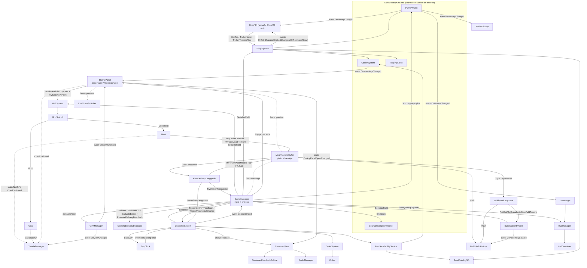

# ARQUITECTURA — Project_Parripollo

> Documentación técnica de referencia. Objetivo: entender el proyecto sin leer los scripts.
> Última revisión completa contra el código: **2026-09-20** (rama `development`, commit `9c4b7cf`).

---

## 0. Ficha técnica

| Campo | Valor |
|---|---|
| Motor | Unity **2022.3.62f3**, URP (2D), Input Manager legacy (`Input.GetKeyDown`) |
| Cámara | **Perspectiva** (`orthographic: 0`, FOV `56`, en `z = -10`). No es ortográfica — ver nota 22 |
| Lenguaje | C#, assembly única `Assembly-CSharp` (sin `.asmdef` en `Assets/Scripts`). `Scripts/Editor/` va a `Assembly-CSharp-Editor` |
| Código propio | `Assets/Scripts/` — **126 archivos, ~19.7k líneas** |
| Third-party | `Assets/AmplifyShaderEditor/` (plugin de shaders, **ignorar**), TextMesh Pro |
| Género | Simulador de parrilla argentina **contrarreloj**: cocinar cortes, armar platos/sándwiches y entregar a los clientes que entran durante la jornada |
| Jornada | **06:30 → 21:00 en 5 minutos reales** (`DayClock`). A las 21:00 cierra y deja de entrar gente; el día termina **cuando se va el último cliente**, no al cerrar |
| Persistencia | Solo `init.cfg` (resolución/FPS). **No hay savegame**: el progreso vive en objetos `DontDestroyOnLoad` |
| Idioma del dominio | Español (`Crudo`, `Jugoso`, `Hecho`, `Muy_Hecho`, `Pasado`, `Quemado`) |

**Escenas (build order)**: `0 MainMenuScene` → `1 GameScene` → `2 TutorialScene` → `3 ShopTutorial` → `4 EndScene`.
`GameOverScene` está en la lista pero **deshabilitada**. `SampleScene.unity` existe pero **no está en build** (legacy).

**Vista única.** Desde el refactor del 2026-08-29 (`9d0c1b5`, ver `PLAN_REFACTOR_BUILDVIEW_GRILLVIEW.md`) todo el
gameplay de una noche —cocinar, armar el plato y entregar— ocurre **dentro de `GrillView`**. La Cooler View y la
Build View están deprecadas: sus `ViewType` siguen en el enum pero `ViewManager.Show` los redirige a `Grill`.

---

## 1. Estructura de módulos

```
Assets/Scripts/
├── (raíz)          Managers globales, modelo base de items/grilla, utilidades, audio
├── Core/           Orquestación de partida, reloj de la jornada (DayClock), armado del plato, staging plato/bandeja, pausa global
├── Grill/          Vista Parrilla: cocción, capas carne/carbón, HUD de hover, VFX de humo/flip
├── Cooler/         Stock persistente (CoolerSystem). Vista Heladera DEPRECADA → StockPanel
├── Build/          Plato: zona de drop, pan/guarniciones/toppings, undo, entrega por arrastre
├── Customers/      Clientes: spawn, paciencia, hover, burbujas de pedido y de feedback
├── Orders/         Modelo y generación de pedidos (corte + punto + pan/toppings)
├── Food/           Catálogo (SO), validación de platos, evaluación económica (cocción + extras)
├── Shop/           Tienda (post-noche): tabs + breadcrumb, compra individual. Dos capas de UI
├── Strikes/        Strikes por clientes perdidos: contador, HUD de X, aviso de gameplay, popup de cierre
├── UI/             ViewManager, Tutorial, SlidingPanel (base de paneles), notificaciones, HUD SO, feedback
│   ├── StockPanel/     Panel deslizante izquierdo: stock → parrilla
│   └── ToppingsPanel/  Panel deslizante derecho: panes / guarniciones / frascos → plato
└── Editor/         Solo editor: reseteo de mejoras al salir de Play
```

### Responsabilidades por carpeta

| Carpeta | Responsabilidad | Archivos clave |
|---|---|---|
| **raíz** | Singletons de sesión (`UIManager`, `AudioManager`, `PlayerWallet`, `CoalConsumptionTracker`), modelo base drag&drop (`Item`), grilla (`GridSlot`), entidades físicas (`Meat`, `Coal`), buffer de carbón, arranque (`Init`), utilidades de escena, `HudManager` | `Item.cs`, `GridSlot.cs`, `Meat.cs`, `Coal.cs`, `PlayerWallet.cs`, `CoalConsumptionTracker.cs`, `AudioManager.cs`, `HudManager.cs`, `SceneManagementUtils.cs` |
| **Core/** | Input global y árbitro de la entrega (`GameManager`), **reloj de la jornada (`DayClock`)** y stats del día (`DayStats`), armado del plato (`BuildStationSystem`), **staging plato ↔ bandeja** (`MeatTransferBuffer`), draggable de la bandeja (`ToBuildDraggableMeat`), basura (`TrashZone`), pausa global (`GamePause`), activador de mejoras (`UpgradeUnlockActivator`) | `GameManager.cs`, `DayClock.cs`, `MeatTransferBuffer.cs` (1145), `BuildStationSystem.cs`, `GamePause.cs`, `ToBuildDraggableMeat.cs` |
| **Grill/** | Propagación de calor y spawn en grilla (`GrillSystem`), datos de corte (`MeatCutSO` — **está en `MeatType.cs`**), toggle capa carne/carbón, barra y burbuja de cocción por hover, contador de apilado de carbón, VFX (`BurnSmoke`, `FlipPuff`) | `GrillSystem.cs`, `MeatType.cs`, `GrillLayerToggle.cs`, `MeatCookHoverBar.cs`, `CoalStackCounter.cs`, `BurnSmoke.cs`, `FlipPuff.cs` |
| **Cooler/** | Stock persistente `ItemDataSO → int` (`CoolerSystem`, DDOL). El resto de la carpeta (visualizadores y draggables de la heladera) está **deprecado** desde el StockPanel | `CoolerSystem.cs` · deprecados: `CoolerStockVisualizer.cs`, `CoalStockVisualizer.cs`, `CoolerDraggableMeat.cs`, `DraggableCoal.cs` |
| **Build/** | Zona de drop del plato (`BuildFoodDropZone`, **un solo corte por plato**), draggables de pan/side/topping, frascos vertibles con salsa (`ToppingDraggable`), historial de undo (patrón Command, **incluye la carne**), **entrega del plato por arrastre** (`PlateDeliveryDraggable`, única vía de entrega) | `BuildFoodDropZone.cs`, `ToppingDraggable.cs` (696), `BuildUndoHistory.cs`, `BuildUndoActions.cs`, `PlateDeliveryDraggable.cs` |
| **Customers/** | Llegada de clientes según el horario del `DayClock` y la curva de afluencia, tick de paciencia, hover de entrega, view + burbuja de pedido + recuadro, **feedback de entrega/abandono/cambio** (burbuja de 4 s con estado, pago y propina), gateo de pick bajo paneles | `CustomerSystem.cs` (1030), `Customer.cs`, `CustomerView.cs`, `CustomerFeedbackBubble.cs`, `CustomerFeedbackConfigSO.cs`, `CustomerFeedbackState.cs` |
| **Orders/** | `Order` (corte + punto pedido + pan/sides/toppings) y generación aleatoria ponderada con toppings | `OrderSystem.cs`, `Order.cs` |
| **Food/** | Catálogo estático (`FoodCatalogSO` : `IFoodCatalogProvider`), reglas de validez (`DishValidator`), **economía de entrega** (`CookingDeliveryEvaluator`: cocción + extras + propina), puente catálogo+stock (`FoodAvailabilityService`) | `CookingDeliveryEvaluator.cs`, `DishValidator.cs`, `FoodCatalogSO.cs` |
| **Shop/** | Lógica de tienda headless (`ShopSystem`) + **dos capas de UI paralelas**: `*UI` (uGUI/Canvas, **la activa** en `EndScene` y `ShopTutorial`) y `*2D` (world-space, prefab `ShopRoot` — presente pero **desactivado**) | `ShopSystem.cs`, `ShopGridUI.cs`, `ShopItemCellUI.cs`, `ShopBreadcrumbUI.cs`, `ShopHeaderUI.cs` |
| **Strikes/** | Penalización de jornada por clientes que se van con paciencia 0 (`StrikeSystem`, singleton de escena), HUD de X (`StrikeHudView`), aviso “¡Te clavaron el cartel!” (`StrikeLimitNotice`) y popup modal de cierre anticipado en `EndScene` (`StrikeEndPopup`) | `StrikeSystem.cs`, `StrikeHudView.cs`, `StrikeLimitNotice.cs`, `StrikeEndPopup.cs` |
| **UI/** | `ViewManager` (hoy casi inerte), tutorial data-driven (`TutorialManager` + `TutorialStepSO`), **`SlidingPanel`** (base abstracta de los dos paneles laterales), notificaciones de parrilla (vivas pero sin disparar), feedback de entrega, `MoneyPopup`, `RollbackButtonUI` | `ViewManager.cs`, `TutorialManager.cs` (985), `SlidingPanel.cs`, `MoneyPopup.cs`, `GrillNotificationManager.cs` |
| **UI/StockPanel/** | Panel izquierdo: estado y layout (`StockPanelController : SlidingPanel`), celda + arrastre directo a la parrilla (`StockPanelSlot`), pestaña (`StockPanelTab`) | `StockPanelController.cs`, `StockPanelSlot.cs`, `StockPanelTab.cs` |
| **UI/ToppingsPanel/** | Panel derecho: hospeda los GameObjects reales de panes/guarniciones/frascos y los acomoda en grilla (`ToppingsPanelController : SlidingPanel`) | `ToppingsPanelController.cs` |
| **Editor/** | `UpgradeStateResetter`: al salir de Play devuelve `UpgradeSO.currentLevel = 0` y restaura los `CoalSO` | `UpgradeStateResetter.cs` |

### Assets de datos

```
Assets/ScriptableObjects/
├── Cuts/            MeatCutSO   — Chinchulin, Costillita de cerdo, Matambre, Paty, Pechuga de pollo, Tira de asado, Vacio
├── Breads/          BreadSO     — Pan de paty, Pan flauta
├── Sides/           SideSO      — Fritas, Ensalada verde, Ensalada de papa y huevo
├── Toppings/        ToppingSO   — Chimichurri, Salsa criolla
├── Variants/        ProductVariantSO
├── Tutorial/        TutorialStepSO ×31 (secuencia ordenada 1..31)
├── Upgrades/        UpgradeSO   — CoalBurnTimeUpgrade, CustomerCapacityUpgrade, TipUpgrade, RadioUpgrade
├── FoodCatalog.asset / FoodCatalogTutorial.asset
├── CustomerFeedbackSO.asset     (CustomerFeedbackConfigSO: tiempos, colores, frases del feedback)
├── ShopConfig.asset / CoalData.asset
├── Chorizo.asset, ChorizoTutorial.asset
└── TEST.asset                   (scratch, sin uso conocido)
```

Prefabs relevantes: `Prefabs/GrillView.prefab` (contiene `StockPanel`, `MeatTray`, `ToBuild`), `Prefabs/[SYSTEMS].prefab`
(las escenas son instancias; ahí viven `GrillSystem`, `CustomerSystem`, `UpgradeUnlockActivator`…), `Prefabs/UI/StockPanel.prefab`,
`Prefabs/UI/PauseCanvas.prefab`, `Prefabs/FeedbackBubble.prefab`, `Prefabs/Cliente*.prefab`. `BuildView.prefab` y
`CoolerView.prefab` siguen en el proyecto pero **no se alcanzan**.

---

## 2. Flujo de datos y comunicación

### 2.1 Grafo de dependencias



### 2.2 Patrones usados

| Patrón | Dónde | Detalle |
|---|---|---|
| **Singleton** (`static Instance`) | `GameManager`, `UIManager`, `AudioManager`, `PlayerWallet`*, `CoolerSystem`*, `ToppingStock`*, `CoalConsumptionTracker`*, `TutorialManager`, `BuildUndoHistory`, `GrillNotificationManager`, `HudManager`, `StockPanelController`, `ToppingsPanelController`, `MeatHoverBubble`, `MeatCookHoverBar`, `CustomerHoverBubble`, `CustomerSelectionFrame`, `DeliveryFeedbackText`, `CustomerFeedbackConfigSO` | `*` = además `DontDestroyOnLoad`. Los de escena se reasignan en `Awake` sin guard. `GrillLayerToggle` usa `private static instance` |
| **Observer** (`event Action`) | Ver tabla 2.3 | Suscripción en `OnEnable`/`Start`, desuscripción en `OnDisable`/`OnDestroy` |
| **Static notification hub + gates** | `TutorialManager.Notify*(...)` y `TutorialManager.Check*Allowed(...)` | 12 `Notify*` (no-op si `Instance == null`) y 11 `Check*Allowed` (devuelven `true` si `Instance == null`) → en `GameScene` el tutorial no existe y nada cambia |
| **Command** | `IBuildUndoAction` + `BuildUndoHistory` (pila) | `AddSideUndoAction`, `AddToppingUndoAction`, `SetBreadUndoAction`, **`AddMeatUndoAction`** (devuelve el corte a la bandeja) |
| **Buffer / staging area** | `MeatTransferBuffer`, `CoalTransferBuffer` | `BufferedMeatData`/`BufferedCoalData` (POCO con tiempos de cocción) + visuales. `MeatTransferBuffer` hoy administra **plato + bandeja**; la cola `ToGrill/MeatHolder` es legado |
| **Duck typing por reflexión / `SendMessage`** | `GameManager`→`MeatTransferBuffer`, `MeatHolderDraggableMeat`, `CoolerDraggableMeat`, `*StockVisualizer` | `Type.GetType` sobre todos los assemblies + `MethodInfo.Invoke` / `SendMessage(..., DontRequireReceiver)`. Rompe el binding estático a propósito |
| **Registro estático de instancias** | `Coal.ActiveCoals`, `BuildFoodDropZone.ActiveZones`, `TrashZone.ActiveZones`, `ToppingDraggable.ActiveInstances`, `PlateDeliveryDraggable.Instances`, `SlidingPanel.OpenPanels` | Alta en `OnEnable`, baja en `OnDisable`/`OnDestroy`. Habilita APIs estáticas tipo `TryAcceptAt`, `ClearAllSplatters`, `AnyPanelOpen` |
| **Data-driven (ScriptableObject)** | `ItemDataSO` → `MeatCutSO`, `CoalSO`, `UpgradeSO`; `BreadSO`, `SideSO`, `ToppingSO`, `ProductVariantSO`, `FoodCatalogSO`, `ShopConfigSO`, `TutorialStepSO`, `HudDatabaseSO`, `CustomerFeedbackConfigSO` | ⚠️ Los SO mutan en runtime (`isUnlocked`, `UpgradeSO.currentLevel`, `CoalSO._maxBurnTime`) → **el estado persiste entre sesiones de Editor** (ver `UpgradeStateResetter`) |
| **Service / Facade** | `FoodAvailabilityService` | Cruza `FoodCatalogSO` (estático) con `CoolerSystem` (stock live) |
| **Static utility / Extension methods** | `DishValidator`, `CookingDeliveryEvaluator`, `SceneManagementUtils`, `MeatHoverText.ToHoverString()`, `OrderText.ToHoverString()`, `CustomerFeedbackExtensions.GetCategory()` | Sin estado, testeables aisladamente |
| **Object pool** | `GrillNotificationManager.groupPool`, `StockPanelController` (slots) | Reutilizan instancias |
| **Construcción procedural de UI** | `GrillNotification*UI.CreateProcedural*`, `CustomerSelectionFrame.BuildBars`, `ToppingDraggable.CreateSauceBar`, `CustomerFeedbackBubble.EnsureVisualHierarchy`, `MoneyPopup`, `GridSlot.MakeRadialGlowSprite` | Generan jerarquía + sprites (`Texture2D`) en runtime si falta prefab |
| **Template Method** | `Item` → `Meat` → `MeatInstance`; `GridSlot` → `GrillSlot`; **`SlidingPanel` → `StockPanelController` / `ToppingsPanelController`** | `virtual OnMouseUp/HandleHeldInput/OnPickedUp/UpdateHoverPreview/Cook`; hooks `OnPanelStarted/OnEnteredGrillView/OnPanelClosing/OnPanelOpened/CanOpen/ValidateReferences` |

### 2.3 Catálogo de eventos

| Emisor | Evento | Consumidores |
|---|---|---|
| `CoolerSystem` | `OnMissingItemRequested(ItemDataSO)` | (sin consumidor actual — hook futuro) |
| `BuildStationSystem` | `OnAssemblyChanged`, `OnAssemblyCleared` | `BuildUndoHistory.Clear` |
| `BuildUndoHistory` | `OnHistoryChanged` | `RollbackButtonUI` (habilita/deshabilita) |
| `PlayerWallet` | `OnMoneyChanged(float)` | `UIManager`, `WalletDisplay`, `ShopHeaderUI`, `ShopGridUI` (→ `RefreshVisuals` de cada celda), (2D: `ShopGrid2D`, `ShopHeader2D`) |
| `ToppingStock` | `OnStockChanged` | `ShopGridUI`, (2D: `ShopGrid2D`, `ShopDetailPanel2D`) |
| `ShopSystem` | `OnTabChanged` | `ShopGridUI` (rebuild), `ShopBreadcrumbUI`, `ShopSubtitleUI`, `ShopNextButtonUI`, (2D: `ShopTabBar2D`, `ShopGrid2D`) |
| `ShopSystem` | `OnCartChanged`, `OnPurchaseResult(bool,string)` | Solo la capa 2D. **La UI activa compra directo y no usa carrito** |
| `GamePause` | `static OnPaused` | Todos los draggables con un arrastre en curso (cancelan y vuelven al origen) |
| `SceneManagementUtils` | `OnSceneLoaded` (static) | (disponible; suscrito vía `RuntimeInitializeOnLoadMethod`) |
| `ShopButton2D` / `ShopTabButton2D` | `OnClicked`, `OnTabClicked(ShopTabType)` | Celdas, barras de tabs |
| `CoalStock` | `OnChanged(int)` | (clase legacy, sin uso activo) |

### 2.4 Secuencia: del stock al cliente (todo dentro de `GrillView`)

```
StockPanel [Q] ──drag directo──► GridSlot de la parrilla
   │  StockPanelSlot.OnMouseDown  → spawnea un "fantasma" sin collider que sigue al mouse
   │                              → hover preview vía MeatTransferBuffer.UpdateMeatHolderHover / CoalTransferBuffer.UpdateCoalHolderHover
   │  StockPanelSlot.OnMouseUp    → CoolerSystem.TryTake(item,1)
   │                              → GrillSystem.TrySpawnMeatAtPoint / TrySpawnCoalAtPoint
   │                              → si el spawn falla: CoolerSystem.Add(item,1)  [rollback]
   │  Soltar sobre el propio panel cancela. Sin buffer intermedio.

Parrilla (cocción por frame)
   │  GrillSystem.Update      → UpdateHeatPropagation() reparte calor entre slots
   │  GridSlot.Update         → coal.Burn(); CalculateInternalHeat(); meat.Cook(totalHeatReceived)
   │  Meat.Cook               → acumula SOLO la cara activa; clamp en burnThreshold
   │  Click derecho           → MeatClickable → Meat.Flip() (cambia cara activa) + FlipPuff

Parrilla ──drag a la zona "ToBuild" (superficie naranja = plato)──► PLATO
   │  Meat.OnMouseUp → prioridad: TrashZone → MTB.TryPlateMeatFromGrill(meat, punto) → grilla → origen
   │  TryPlateMeatFromGrill → BuildFoodDropZone.TryAcceptMeatAt (rechaza si el plato YA tiene un corte)
   │                        → BuildStationSystem.AddCut(cut, state, A, B)   [conserva tiempos de cocción]
   │                        → destruye el Meat, AdoptVisualIntoPlate → AddComponent<PlateDeliveryDraggable>
   │                        → BuildUndoHistory.Push(AddMeatUndoAction)

ToppingsPanel [T] ──drag──► plato
   │  BuildDraggableFoodItem (pan / side) → BuildFoodDropZone.TryAcceptAt → SetBread / AddSide + visual + Push(undo)
   │  ToppingDraggable (frasco)           → verter sobre PouringZone → AddTopping + salpicaduras + Push(undo)

Undo  [RollBackButton → BuildUndoHistory.UndoLast]
   │  Pan/side/topping: se quitan del armado y del plato
   │  Carne: AddMeatUndoAction → MTB.TryReturnPlateMeatToTray → el corte pasa a la BANDEJA (MeatTray, superficie gris)

Bandeja (MeatTray) ──drag (ToBuildDraggableMeat)──► plato   → MTB.TryPlateFromTrayById
                    ──drag──────────────────────► parrilla → MTB.TryDropFromTrayById  (vuelve a cocinarse con sus tiempos)

Entrega — ÚNICA vía: arrastrar el plato (PlateDeliveryDraggable) hasta un cliente
   │  Update (pick propio, sin OnMouseXXX) → agarra el plato COMPLETO como bloque (carne + sides/toppings)
   │  Durante el drag → Physics2D.OverlapPointNonAlloc busca CustomerView bajo el mouse
   │                  → CustomerSystem.SetDeliveryDragHover(view) → recuadro + burbuja con PREVIEW ($ + propina o motivo)
   │                  → GameManager.ShowDeliveryPreviewOnPlate → tinte por corte
   │  Soltar sobre cliente → GameManager.TryDeliverToCustomer(view.Customer)
   │        false (rechazo) → el plato vuelve intacto a su sitio
   │  Soltar al vacío     → sobre la bandeja: TryReturnPlateMeatToTray · sobre hueco libre de grilla: TryReturnPlateMeatToGrill
   │                      → en cualquier otro lado: vuelve al plato

  TryDeliverToCustomer(Customer) → bool
   │     1. EvaluateDelivery (puro): cliente válido y no en feedback → HasAnyCut → corte == order.PrimaryCut
   │        → TryBuildSandwich / TryBuildPlatedDish → CookingDeliveryEvaluator.Validate (Crudo/Quemado BLOQUEAN)
   │        → EvaluateCut por corte → EvaluateExtras (toppings/pan) → EvaluateDeliveryFeedback (propina + estado)
   │     2. Rechazo: DeliveryFeedbackText + FlashPlateMeatVisuals si bloqueó por cocción → return false
   │     3. Aceptada: nota de extras (si hay) · limpiar plato · MoneyPopup.Spawn · PlayerWallet.Add
   │        → CustomerSystem.TriggerDeliveryFeedback (burbuja 4 s, el slot sigue ocupado) → al terminar RemoveCustomer
```

---

## 3. Clases centrales

### 3.1 Orquestación

#### `GameManager` — `Core/GameManager.cs` · Singleton
Bucle de input global y árbitro de la entrega. **No** contiene lógica de cocción ni de vistas.

| Campos clave | |
|---|---|
| `[SF] customerSystem, grillSystem, coolerSystem, viewManager, buildStationSystem, shopSystem, wallet, grillLayerToggle, foodAvailabilityService, catalog` | Referencias de inspector |
| `[SF] MonoBehaviour meatTransferBuffer, coalTransferBuffer` | ⚠️ Tipados como `MonoBehaviour`: `meatTransferBuffer` se invoca **solo por `SendMessage`**; `coalTransferBuffer` ya no se usa desde acá |
| `[SF] KeyCode stockPanelToggleKey = Q, toppingsPanelToggleKey = T, clearPlateKey = C` | Teclas configurables |
| `[SF] Color previewExactTint / OffByOne / OffByTwo / Blocked` | Header *Delivery Preview Tints* |

```csharp
public CustomerSystem Customers { get; }          // acceso para PlateDeliveryDraggable
public struct DeliveryEvaluation { accepted, rejectReason, rejectShort, cookingBlocked, validation,
                                   payment, tip, worstOffset, feedbackState, extras, extrasNote, cutOffsets }
public DeliveryEvaluation EvaluateDelivery(Customer) // reglas de entrega SIN efectos: preview + entrega real
public void ShowDeliveryPreviewOnPlate(DeliveryEvaluation), ClearDeliveryPreviewOnPlate()
public bool TryDeliverToCustomer(Customer)        // ÚNICO lugar con efectos de entrega
public void EndNight()   // desuscribe, DayClock.StopDay(), tracker.RegisterDayCompleted(), carga "EndScene"
// privados: TryToggleGrillLayer, ClearBuildAssembly, CleanAshes
```

`Start()` fuerza `grillSystem.SetMeatVisualsVisible(true)` (vista única: la parrilla siempre se ve y siempre
cocina), se suscribe a `OnNightEnded` y publica la noche en el HUD. `Update()` es solo input (ver 4.4); no hay
transiciones de vista.

**Evaluación vs. efectos.** Las reglas viven en `EvaluateDelivery(Customer)`, que es puro. `TryDeliverToCustomer`
la llama y aplica los efectos. `CustomerSystem.SetDeliveryDragHover` también la llama para el **preview** en la
burbuja mientras se arrastra el plato (`$X + $Y propina` / `$X - sin propina` / motivo del rechazo en rojo): lo que
muestra la burbuja es exactamente lo que va a pasar al soltar. Al tocar una regla, tocar solo `EvaluateDelivery`.

Orden de las reglas: cliente válido y **no en feedback** → `HasAnyCut` → corte == `order.PrimaryCut` (si no, todos los
`cutOffsets` en `CutBlocked`) → `TryBuildSandwich`/`TryBuildPlatedDish` → `Validate` (cocción) → `EvaluateCut` por corte
→ **`EvaluateExtras`** (toppings y pan, ver 3.4) → si bloqueó por cocción: `payment = 0`, `rejectShort` = `Crudo` /
`Quemado` / `Crudo y quemado` → `EvaluateDeliveryFeedback` con `catalog.GetTipMultiplier()`.

Si una entrega se bloquea por cocción, `GameManager` manda `FlashPlateMeatVisuals(List<int>)` a `MeatTransferBuffer`
con los índices crudos + quemados y el mensaje nombra cada corte afectado. Si la entrega se acepta pero con extras
mal (`extrasNote != null`), el mensaje de `DeliveryFeedbackText` explica por qué cobró menos.

`cutOffsets` (uno por corte, `CutBlocked = -1`) alimenta `ShowDeliveryPreviewOnPlate` → tintes por
`SendMessage("SetPlateMeatTints", List<Color>)`; al salir del cliente `ClearDeliveryPreviewOnPlate` →
`ClearPlateMeatTints`. Un tinte nuevo corta un flash en curso; un `Clear` con flash en curso no hace nada.

`M` (corte faltante): busca un sustituto con stock en `foodAvailabilityService.GetAvailableCuts()` y llama
`customerSystem.TriggerMissingCutChange(cliente, sustituto)` (cambia el pedido, anula la propina, burbuja de
feedback amarilla). Sin sustituto, solo avisa.

#### `ViewManager` — `UI/ViewManager.cs`
```csharp
ViewType CurrentView { get; }
event Action<ViewType> OnViewChanged;
void Show(ViewType)
void NextView(), PreviousView()     // DEPRECADOS: no-op
```
`grillRoot` se oculta desactivando **renderers/colliders/canvases** (queda activo, sigue cocinando);
`coolerRoot`/`buildRoot`/`shopRoot` usan `SetActive` real.

⚠️ **Solo existe la vista `Grill`.** `Show(Cooler)` y `Show(Build)` **redirigen a `Grill`** con warning, así que
`OnViewChanged` nunca dispara durante una noche. `Show` además pide permiso a `TutorialManager.CheckViewChangeAllowed`.
Los miembros `ViewType.Cooler` / `Build` se conservan porque el enum se serializa como `int` en los assets de tutorial
(`TutorialStepSO.requiredView`) y quitarlos correría `Build` y `Shop`. `ViewType.Shop` lo usa el tutorial para el gate
del paso `ShowShop`.

#### `UIManager` — `UIManager.cs` · Singleton
```csharp
bool IsPaused { get; }
void PauseGame(), UnPauseGame()
void SetActualDay(int), SetTotalCustomers(int), SetActualCustomers(int), SetActualMoney(float)
int  GetActualDay(), GetActualMoney(), GetTotalCustomersPerDay(), GetActualCustomers()
```
Instancia `pauseCanvasPrefab` on-demand y delega el estado a `GamePause.SetMenuPaused`.
`IsPaused` refleja `GamePause.IsMenuPaused`, no el canvas. Delega el render a `HudManager` → `HudContainer`.
`PauseMenuHandler` es el script de los botones del `PauseCanvas`.

#### `HudManager` / `MoneyPopup` — plata con juice
`HudManager` es singleton de escena (`Instance`). Al cobrar, `GameManager.TryDeliverToCustomer` hace
`MoneyPopup.Spawn(posCliente, pago + propina)` **antes** de `PlayerWallet.Add`: el popup (`TextMeshPro`
world-space creado en runtime, fuente `TMP_Settings.defaultFontAsset`) hace pop, sube, y vuela hasta el
contenedor `Money` del HUD (`HudCanvas` es world-space; el destino se proyecta al plano z del popup por
cámara — nota 22). Como `MoneyPopup.InFlight > 0` cuando llega `UpdateMoneyText`, el HUD **no** pisa el
número: espera `OnMoneyPopupArrived` (o un fallback de la duración del vuelo), hace punch de escala y
cuenta animado hasta el valor real. Bajas de plata (tienda) y subas sin popup se aplican al instante.
Estilo del popup y del punch: `HudManager` → header *Money Popup* (`MoneyPopupStyle`).

#### `GamePause` — `Core/GamePause.cs` · estática
```csharp
bool IsPaused, IsMenuPaused, IsDialogPaused
event Action OnPaused                           // una vez por transición no pausado → pausado
void SetMenuPaused(bool), SetDialogPaused(bool), Reset()
```
**Único escritor** de `Time.timeScale`, `Camera.main.eventMask` y `AudioListener.pause`. Dos fuentes
independientes (menú de `Esc` vía `UIManager`; diálogo de `TutorialOfferController`): el juego queda
pausado mientras cualquiera esté activa.

- `timeScale = 0` congela todo lo que usa `deltaTime` / `Time.time` / `WaitForSeconds`: cocción,
  carbón, paciencia, `SpawnLoop`, feedback de clientes, flips, salsas, burbujas.
- `eventMask = 0` apaga los `OnMouseXXX` de los colliders del mundo: solo responde la UI del canvas de pausa.
- `AudioListener.pause = true` silencia los SFX en curso.
- `OnPaused` cancela los arrastres en curso: cada draggable se suscribe al agarrar y se desuscribe al
  soltar/cancelar, y al pausar vuelve a su origen (`Item`, `MeatHolderDraggableMeat`,
  `CoalHolderDraggableCoal`, `ToBuildDraggableMeat`, `BuildDraggableFoodItem`, `ToppingDraggable`,
  `StockPanelSlot`, `PlateDeliveryDraggable`).
- `SceneManagementUtils` llama `Reset()` antes de cada carga: `timeScale` y `AudioListener.pause`
  persisten entre escenas.

---

#### `DayClock` — `Core/DayClock.cs` · Singleton (opcional por escena)
**Única fuente de la hora del juego.** Mapea la franja del local sobre segundos reales.

```csharp
event Action OnClosingTime;               // una sola vez, al llegar a la hora de cierre
bool  IsRunning, HasClosed, IsOpen;
float OpeningHour, ClosingHour, DayDurationSeconds;
float CurrentHour;                        // horas decimales: 6.5 = 06:30
float Normalized01;                       // 0 apertura → 1 cierre; entrada de la curva de afluencia
float RemainingRealSeconds;
string TimeLabel, HudLabel;               // "06:30" · HudLabel pasa a closedLabel ("CERRADO") al cerrar
void StartDay(), StopDay();
void CloseEarly(string reason);          // salta al cierre y dispara OnClosingTime (lo usa el 3er strike)
static string FormatHour(float hour, int minuteStep = 1);
```

| Campo de inspector | `GameScene` | |
|---|---|---|
| `openingHour` / `closingHour` | `6.5` / `21` | Horas decimales |
| `dayDurationSeconds` | `300` | Partida de 5 minutos |
| `displayMinuteStep` | `5` | El HUD salta de 5 en 5 minutos de juego: a esta velocidad, mostrar cada minuto es ilegible |
| `closedLabel` | `CERRADO` | Reemplaza la hora en el HUD desde el cierre |

Corre con `Time.deltaTime`, así que **`GamePause` lo congela solo** (`timeScale = 0`) — no hay
que pausarlo a mano. Empuja el texto al HUD (`UIManager.SetDayTime`) **solo cuando cambia**, no por frame.
El reloj **no termina el día**: al llegar al cierre se detiene y avisa; quién cierra la jornada es
`CustomerSystem` (ver 3.5 y 4.5).
⚠️ Es **opcional**: una escena sin `DayClock` (el tutorial) mantiene el modo viejo de cupo fijo de clientes.

### 3.2 Parrilla y cocción

#### `GrillSystem` — `Grill/GrillSystem.cs`
```csharp
List<GridSlot> slots;  GameObject meatPrefab, coalPrefab;
bool SpawnMeat(MeatCutSO, bool rotateFootprint = false)
bool TrySpawnMeatAtPoint(MeatCutSO, Vector3, out Meat, bool rotateFootprint = false)
bool TrySpawnCoalAtPoint(CoalSO, Vector3, out Coal)   // → CoalConsumptionTracker.ReportConsumption(1)
Meat GetCookedMeat(MeatCutSO)                         // ⚠️ sin llamadores
void RemoveMeat(Meat)                                 // ⚠️ idem
void SetMeatVisualsVisible(bool)
```
`Awake` → `GridSlot.AssignGridCoordinates(slots)`. `Update` → `UpdateHeatPropagation()`:

```
reset:      slot.totalHeatReceived = slot.internalHeat
vecinos:    |dx|<=1 && |dy|<=1  → factor 0.35 (ortogonal) / 0.20 (diagonal)
columna:    |dx|<=1 && source.gridY > target.gridY && dy<=3 → factor 0.4 / dy
clamp:      AddExternalHeat → Mathf.Min(10f, ...)
```

#### `GridSlot` — `GridSlot.cs`
```csharp
ItemType acceptsType;  GameObject currentItem;  List<Coal> stackedCoals;  // MAX_COAL = 3
float internalHeat, totalHeatReceived;  int gridX, gridY;
bool IsOccupied { get; }   Meat currentMeat { get; }

void PlaceItem(GameObject), PlaceMeat(Meat), ClearSlot(), RemoveCoal(Coal)
bool CanPlaceItem(ItemType, GameObject)     // respeta GrillLayerToggle.IsItemTypeAllowed
void SetHoverPreview(bool, bool), ClearHoverPreview(), SetBaseHoverColor(Color)

static List<List<GridSlot>> BuildLogicalRows(IList<GridSlot>)
static void AssignGridCoordinates(IList<GridSlot>)
static bool TryFindContiguousPlacement(IList<GridSlot>, Vector2Int size, Vector3 worldPoint,
                                       ItemType, GameObject incoming, out List<GridSlot>)
static void ConfigureHeatGlow(...)
```
`Update`: quema carbones → `CalculateInternalHeat()` (pila: `×1.0`, `×0.307`, `×0.153`) → `meat.Cook(totalHeatReceived)`.
Las filas se agrupan por Y mundial (`AXIS_TOLERANCE = 0.1`); **la columna es índice de orden dentro de la fila y por `acceptsType`** — nunca X mundial.

#### `Meat : Item` — `Meat.cs`
```csharp
MeatCutSO cut;  float sideACookTime, sideBCookTime;  bool isSideA;  MeatStates state;

float SideAProgress01, SideBProgress01, CookedPercent01, ActiveSideProgress01
float HeatScale, BurnThreshold
MeatStates SideAState, SideBState, ActiveSideState
bool IsAnySideBurned, IsOnGrill, IsSideAActive, IsGridRotated

virtual void Cook(float heatFromSlot)   // no-op si TutorialManager.IsCookingPaused; 1 vez por frame
void Flip()                             // invierte cara → FlipPuff + TutorialManager.NotifyMeatFlipped
void SetCut(MeatCutSO), SetGridRotation(bool), ToggleGridRotation()
void RegisterOccupiedSlot(GridSlot), UnregisterOccupiedSlot(GridSlot), ReleaseOccupiedSlots()
void RefreshState()                     // deriva estado del calor → NotifyMeatStateChanged
```
`OnMouseUp` prioriza: `TrashZone` → `MeatTransferBuffer.TryPlateMeatFromGrill` (gateado por
`TutorialManager.CheckMeatDragToBuildAllowed`) → si el punto cae sobre un plato **ya ocupado** vuelve al origen
(`BuildFoodDropZone.IsPlateOccupiedAt`, para no caer en los slots que el plato tapa) → colocación en grilla → origen.
`R` mientras se arrastra rota el footprint. `MeatInstance : Meat` añade audio de chisporroteo.
VFX: `smokePrefab` (con `BurnSmoke`) se instancia cuando `IsAnySideBurned` pasa a `true`; `FlipPuff` (hijo,
`ParticleSystem` emitido a mano) dispara en cada `Flip()` sin importar el estado.

#### `MeatCutSO : ItemDataSO` — **`Grill/MeatType.cs`** (nombre de archivo ≠ clase)
```csharp
string cutName => itemName;   Vector2Int GrillSpace;   Vector3 visualOffset;
CookingSprites cookingSpritesA, cookingSpritesB;   float timeHeatA, timeHeatB, heatScale;
ServingMode servingMode;   BreadSO requiredBread;   bool isUnlocked;
float sellPricePlate, sellPriceSandwich;

float GetHeatScale()        // heatScale, o timeHeat*3 si es 0
float GetStateBandHeat()    // S / 6
float GetBurnThreshold()    // 5S / 6  ← tope de acumulación por cara
MeatStates GetStateForHeat(float)   // floor(heat / band), clamp 0..5
Sprite GetSpriteForState(MeatStates, bool sideA)
```

**Modelo de cocción — la escala `S` se divide en 6 bandas iguales:**

| Índice | Estado | Rango de calor acumulado |
|---|---|---|
| 0 | `Crudo` | `[0, S/6)` — no entregable |
| 1 | `Jugoso` | `[S/6, 2S/6)` |
| 2 | `Hecho` | `[2S/6, 3S/6)` |
| 3 | `Muy_Hecho` (UI: "Bien Hecho") | `[3S/6, 4S/6)` |
| 4 | `Pasado` | `[4S/6, 5S/6)` — último punto válido |
| 5 | `Quemado` | `>= 5S/6` — irreversible, no entregable |

Cada cara acumula por separado. Solo acumula la cara **apoyada** (`isSideA`).

#### `Coal : Item` — `Coal.cs`
```csharp
static readonly List<Coal> ActiveCoals;   // registro global (usado por CleanAshes)
CoalSO coalData;  float currentBurnTime;  CoalStates state;
float MaxBurnTime => coalData != null ? coalData.maxBurnTime : maxBurnTime (fallback 60)
float GetCurrentHeatOutput()   // 6.5 * (1 - burnTime/MaxBurnTime), solo si Encendido
void Burn(), SetVisualVisibility(bool), RegisterOccupiedSlot(GridSlot), ReleaseOccupiedSlots()
```
`enum CoalStates { Apagado, Encendido, Ceniza }` — `Apagado` pasa a `Encendido` en el primer `Burn()`.
`CoalSO._maxBurnTime` es el valor real (60 por defecto; la mejora `CoalBurnTime` lo sube a 200 vía `SetMaxBurnTime`).

#### `GrillLayerToggle` — `Grill/GrillLayerToggle.cs`
```csharp
enum GrillLayer { Meat, Coal }
GrillLayer CurrentLayer { get; }
static bool IsItemTypeAllowed(ItemType)   // gatea GridSlot.CanPlaceItem
void Toggle(), ShowLayer(GrillLayer), RefreshVisibility()
```
La capa inactiva queda visible con `inactiveAlpha` y colliders desactivados.
Dos entradas para `Toggle()`: el `OnMouseDown` del propio botón en la escena y `Space` desde
`GameManager.TryToggleGrillLayer()` (ignorado si hay un botón del mouse apretado). Ambas pasan por `ShowLayer`,
así que el icono del botón y `TutorialManager.NotifyGrillLayerChanged` quedan siempre sincronizados.

#### Mapa de calor (`GridSlot.LateUpdate`)

Cada slot de carne cuelga en runtime un hijo `HeatGlow`: `SpriteRenderer` con un **degradado radial**
generado por código (`MakeRadialGlowSprite`, 64px, 1×1 unidades), color `Lerp(heatMapLowColor,
heatMapHighColor, k)` y alpha `k × heatMapMaxAlpha × flicker`, con `k = clamp01(totalHeatReceived /
heatMapFullHeat)`. Por qué un resplandor y no un tinte del slot: la parrilla está en perspectiva y el
sprite rectangular del slot (escala 0.85×0.49, alineado a pantalla) delataba el escorzo con sus
bordes; un degradado no tiene bordes, y como es hijo del slot hereda su escala aplastada y sale como
elipse escorzada. `heatMapGlowScale` (1.6) lo hace más grande que el slot para que los vecinos se
fundan en un campo continuo. `heatMapSortingOrder = -1`: sobre el fondo `Parrilla` (-2) y **debajo de
las barras** (`Grill`, 0), así el calor se ve entre las barras como brasa. Config en `GrillSystem` →
header *Heat Map* (`[SYSTEMS].prefab`), aplicada a todos los slots vía `GridSlot.ConfigureHeatGlow`
(estática; `OnValidate` la refresca en Play). Solo `acceptsType == Meat` y solo con la capa Meat
activa; el hover preview sigue en el sprite del slot y no se toca. Se apaga con `showHeatMap = false`.

#### `CoalStackCounter` — `Grill/CoalStackCounter.cs`

Contiene también `CoalStackCounterStyle`. Feedback visual del stack de carbón: etiqueta `TextMeshPro`
(world-space) con el texto `x{N}` en la esquina **inferior derecha** del sprite de cada `GridSlot`
de tipo `Coal`.

| Aspecto | Detalle |
|---|---|
| Creación | `GrillSystem.Start()` → `SetupCoalStackCounters()` engancha un `CoalStackCounter` a cada slot con `acceptsType == ItemType.Coal` (60 en `GameScene`). No hay setup manual por slot |
| Anclaje | Hijo del slot. `rectTransform.pivot = (1,0)` + `localPosition` calculada desde `spriteRenderer.sprite.bounds` (esquina `max.x`, `min.y`) + offset configurable. Escala heredada del slot |
| Umbral | Solo visible con **2 o más** carbones apilados (`MIN_VISIBLE_COUNT = 2`). Con 1 o 0 no se muestra texto |
| Ocultamiento | También se oculta si la capa activa no es Coal (`GrillLayerToggle.IsItemTypeAllowed`) o si `GrillSystem.SetMeatVisualsVisible(false)` (`SetViewVisible`) |
| Refresco | `LateUpdate` por slot; solo reasigna texto y `SetActive` cuando el conteo o la visibilidad cambian |

**Configuración** (`GrillSystem` → header *Coal Stack Counter*, serializada en `Assets/Prefabs/[SYSTEMS].prefab`,
del que las escenas son instancias):

| Campo | Valor por defecto |
|---|---|
| `font` | `Assets/Fonts/Bungee-Regular SDF.asset` |
| `fontSize` | `4` (slot ≈ 0.52 × 0.55 unidades de mundo) |
| `textColor` | Blanco |
| `offset` | `(-0.06, 0.06)` — unidades locales hacia adentro desde la esquina inferior derecha |
| `sortingOrder` | `50` — por encima del sprite de carbón (`sortingOrder = 2`) |

**Gotcha (TMP 3.0.7)**: el `TextMeshPro` se agrega con el GameObject todavía en la raíz y **después** se
parenta al slot. Los slots pueden estar inactivos al arrancar; si se
parenta primero, el `Awake` de TMP no corre, `m_renderer` queda null y asignar `.font` tira
`NullReferenceException` en `TMPro_Private.cs:526`. Por el mismo motivo el setup va en `Start()` y no en `Awake()`.

---

### 3.3 Inventario, paneles laterales y staging

#### `CoolerSystem` — `Cooler/CoolerSystem.cs` · Singleton + DDOL
```csharp
event Action OnInventoryChanged;
event Action<ItemDataSO> OnMissingItemRequested;

int  GetCount(ItemDataSO)
IEnumerable<KeyValuePair<ItemDataSO,int>> EnumerateStock()
void Add(ItemDataSO, int = 1)          // carbón capeado a 40
void SetStockDirectly(ItemDataSO, int)
bool TryTake(ItemDataSO, int = 1)
void InformMissingItem(ItemDataSO)
static void PrepareForNewGame()        // invalida el backup estático
```
Guarda un `static stockBackup` en `OnDestroy` para sobrevivir a destrucciones inesperadas del DDOL; `SceneManagementUtils.ReturnToMainMenu()` lo limpia.

#### `SlidingPanel` — `UI/SlidingPanel.cs` · **abstracta**, base de los dos paneles laterales
Resuelve deslizamiento, gateo por vista, área de cancelación de drops y el registro global de paneles abiertos.
Los nombres de los campos serializados son los que tenía `StockPanelController` (`slidingRoot`, `panelBackground`,
`viewManager`, `openLocalX`, `closedLocalX`, `slideDuration`), así los prefabs y overrides viejos siguen resolviendo.

```csharp
bool IsOpen, IsAnimating, CanBeginDrag;           // CanBeginDrag = IsOpen && !animando
static bool AnyPanelOpen;                         // OpenPanels.Count > 0
static event Action<bool> OnAnyPanelOpenChanged;  // dispara cada vez que un panel entra o sale del registro
static bool IsAreaCoveredByOpenPanel(Bounds)      // solapamiento XY contra el fondo de cada panel en su posición ABIERTA
bool IsPointOverPanel(Vector3), SetViewManager(ViewManager)
void Toggle(), Open(), Close(bool instant = false)

// hooks para las subclases
protected virtual void OnPanelStarted(), OnEnteredGrillView(), OnPanelClosing(), OnPanelOpened()
protected virtual bool CanOpen()                  // false rechaza Open() (lo usa el tutorial)
protected virtual void ValidateReferences()       // el hijo llama base.ValidateReferences()
```

- `Start()`: activa `slidingRoot`, `OnPanelStarted()`, `Close(true)`. Arranca **cerrado** porque `ViewManager.Show(Grill)`
  inicial no dispara `OnViewChanged`.
- `Open()` → `CanOpen()` → `SetOpenState(true)` → deslizar → **`AudioManager.PlayTableSlide()`** → `OnPanelOpened()`.
  El sonido va acá y no en `GameManager` porque la pestaña lateral también abre el panel.
- La corrutina de deslizamiento usa **`Time.unscaledDeltaTime`** (el diálogo de `TutorialOfferController` pone `timeScale = 0`).
- Los estáticos (`OpenPanels`, `OnAnyPanelOpenChanged`) se limpian con `[RuntimeInitializeOnLoadMethod(SubsystemRegistration)]`
  por si el Editor entra a Play sin domain reload.
- `IsAreaCoveredByOpenPanel` mide el panel **en su posición final abierta** (`GetOffsetToOpenPosition`), así la respuesta
  no depende de que el deslizamiento haya terminado. Lo consume `CustomerView` (ver 3.5).

#### `StockPanelController : SlidingPanel` — `UI/StockPanel/StockPanelController.cs` · Singleton
Panel izquierdo de stock. Reemplaza a la Cooler View. Vive anidado en `Prefabs/GrillView.prefab` como instancia de
`Prefabs/UI/StockPanel.prefab`.

```csharp
static StockPanelController Instance;
GrillSystem Grill; MeatTransferBuffer MeatBuffer; CoalTransferBuffer CoalBuffer;   // para los slots
void RefreshSlots()
void NotifyDragStarted(StockPanelSlot), NotifyDragEnded(StockPanelSlot), CancelActiveDrag()
bool IsPointInDropArea(Vector3)
// hooks: OnPanelStarted → RefreshSlots · OnEnteredGrillView → RefreshSlots · OnPanelClosing → CancelActiveDrag
//        OnPanelOpened → TutorialManager.NotifyStockPanelOpened · CanOpen → TutorialManager.CheckStockPanelOpenAllowed
```

- **No duplica stock**: se suscribe a `CoolerSystem.OnInventoryChanged` y repinta. Las cantidades salen siempre de `GetCount`.
- **Orden de slots determinista**: `FoodCatalogSO.GetAllCuts()` filtrado por `stock > 0`, después los cortes con stock que no estén en el catálogo (ordenados por `itemName` — así aparece `ChorizoTutorial`), y el carbón **siempre último y siempre visible**, gris cuando está en 0. Nunca usar `EnumerateStock()` directo: el orden del `Dictionary` no es determinista.
- Layout de grilla manual (`columns`, `cellSpacing`, `firstCellLocalOffset`), slots pooleados, sin scroll.
- `GameManager` lo abre con `Q` solo si ya está abierto o `TutorialManager.CheckStockPanelOpenAllowed()`.

#### `StockPanelSlot` — `UI/StockPanel/StockPanelSlot.cs`
Una celda = una variedad. `Bind(ItemDataSO, count, owner)`, `SetSortingOrder(int)`, `CancelDrag()`.
Maneja el arrastre completo desde `OnMouseDown` hasta `OnMouseUp` **en el mismo componente**: Unity
no transfiere `OnMouseDrag`/`OnMouseUp` a otro collider, así que el fantasma que sigue al mouse no
puede hacerse cargo del drag. El preview de colocación lo dibujan los buffers (`MeatBuffer.UpdateMeatHolderHover`,
`CoalBuffer.UpdateCoalHolderHover`) — es el único uso vivo de esas APIs. `FitIconToSlot()` escala el ícono por
`sprite.bounds`. `R` rota el footprint (solo carne). El arrastre pide permiso a `TutorialManager.CheckStockDragAllowed(item)`.

Gates del drop, **antes** de cualquier `TryTake`:
1. Soltar sobre el propio panel cancela siempre (`IsPointOverPanel`).
2. `requireDropAreaHit` + `dropArea` (opcional, **off** por defecto) exige soltar dentro de un collider concreto.

#### `StockPanelTab` — `UI/StockPanel/StockPanelTab.cs`
Pestaña lateral con `BoxCollider2D` + `OnMouseDown` → `controller.Toggle()`.

#### `ToppingsPanelController : SlidingPanel` — `UI/ToppingsPanel/ToppingsPanelController.cs` · Singleton
Panel derecho (espejo del StockPanel, arriba a la derecha). Reemplaza al `FoodItemsContainer` de la Build View.
**No es data-driven**: hospeda los GameObjects reales de panes, guarniciones y frascos, que conservan su propia
lógica (`BuildDraggableFoodItem`, `ToppingDraggable`). Solo aporta deslizamiento, layout en grilla
(`itemsParent`, `columns`, `cellSpacing`, `firstCellLocalOffset`, `itemSortingOrder = 100` para quedar sobre el
fondo del panel) y `OnPanelClosing` → `ToppingDraggable.CancelDrag()` de cada frasco. `autoLayoutItems` apagado
respeta las posiciones puestas a mano. No tiene prefab: vive como override de instancia en `GameScene`.
`GameManager` lo abre con `T`.

#### `MeatTransferBuffer` — `Core/MeatTransferBuffer.cs` (1145 líneas, el archivo más grande)
Staging de cortes **fuera de la parrilla, dentro de `GrillView`**. Dos destinos vivos + una cola legado:

```
Plato   (plateMeatCuts / plateMeatVisuals)  — cortes montados en BuildStationSystem. Entran desde la parrilla
                                              (TryPlateMeatFromGrill) o desde la bandeja (TryPlateFromTrayById)
Bandeja (trayCuts / trayVisuals, anchor MeatTray) — cortes que salieron del plato por undo o por arrastre.
                                              Vuelven al plato o a la parrilla conservando la cocción
ToGrill → MeatHolder                        — LEGADO de la Cooler View. Nadie lo alimenta
```

`BufferedMeatData` (POCO privado): `cut`, `sideACookTime`, `sideBCookTime`, `isSideA`, `state`, `isGridRotated`;
`FromMeat`, `FromCut`, `ApplyTo(Meat, rotate)`.

```csharp
// Parrilla → Plato
bool TryPlateMeatFromGrill(Meat, Vector3)             // TryAcceptMeatAt → destruye el Meat → AdoptVisualIntoPlate → Push(AddMeatUndoAction)
// Bandeja → Plato / Parrilla
bool TryPlateFromTrayById(int entryId, Vector3)       // TryAcceptMeatAt → recicla el visual → Push(AddMeatUndoAction)
bool TryDropFromTrayById(int entryId, Vector3, bool rotateFootprint)   // TrySpawnMeatAtPoint + ApplyTo
// Plato → Bandeja / Parrilla
bool TryReturnPlateMeatToTray(GameObject plateVisual = null)          // undo y drop sobre la bandeja; null = último
bool TryReturnPlateMeatToGrill(GameObject plateVisual, Vector3)       // solo si hay hueco libre
bool IsOverMeatTray(Vector3)                          // mide SOLO el subárbol del anchor MeatTray
// Visuales del plato (los primeros 4 los llama GameManager por SendMessage)
void ClearPlateMeatVisuals(), FlashPlateMeatVisuals(List<int>), SetPlateMeatTints(List<Color>), ClearPlateMeatTints()
void SetPlateMeatVisualsVisible(bool), UpdatePlateMeatSprite(Sprite)
bool TryCaptureLastPlateMeatVisual(out GameObject, out Sprite, out Vector3, out Vector3)  // undo del pan
void RestorePlateMeatVisual(GameObject, Sprite, Vector3, Vector3)                          // undo del pan
// Legado (Cooler View) — sin llamadores salvo el hover preview del StockPanel
void EnqueueToGrill(MeatCutSO), EnqueueToGrillAtPoint(...), MoveToMeatHolder()
bool TryDropFromMeatHolder[ById](..., bool rotateFootprint)
void UpdateMeatHolderHover(MeatCutSO, Vector3, bool), ClearMeatHolderHover(), RefreshVisuals()
```

`AdoptVisualIntoPlate(entry, visual, punto)` es **el único lugar que crea visuales de carne en el plato**: instancia
`visualPrefab` (o recicla el de la bandeja), lo deja en mundo con `fixedWorldScale`, sprite del estado, `sortingOrder`
= `plateMeatSortingBase (400) + índice`, destruye cualquier `ToBuildDraggableMeat` y agrega `PlateDeliveryDraggable`.
Anclas por nombre si faltan en el inspector: `ToBuild` y **`MeatTray`** bajo `GrillView` (`MeatTray` es el viejo
`MeatHolder` de la Cooler View, renombrado). `IsOverMeatTray` mide solo el subárbol del anchor porque su padre es el
root de `GrillView` y medirlo entero tragaba media parrilla.

#### `ToBuildDraggableMeat` — `Core/ToBuildDraggableMeat.cs`
Draggable de los cortes de la **bandeja** (el nombre es histórico). `Setup(cut, buffer, entryId, rotated)`.
`OnMouseUp` → `TryPlateFromTrayById` y, si falla, `TryDropFromTrayById`; si ambos fallan vuelve a la bandeja.
`R` rota el footprint. Se suscribe a `GamePause.OnPaused` al agarrar.

#### `CoalTransferBuffer` — `CoalTransferBuffer.cs`
Dos colas (`ToGrill` → `CoalHolder`) heredadas de la Cooler View: `EnqueueToGrill[AtPoint]`, `MoveToCoalHolder()`,
`TryDropFromCoalHolderById(int, Vector3)`, `UpdateCoalHolderHover`, `ClearCoalHolderHover`, `RefreshVisuals`.
Hoy solo se usa el **hover preview** desde `StockPanelSlot`; el carbón va del panel a la grilla sin pasar por acá.

---

### 3.4 Armado y entrega

#### `BuildStationSystem` — `Core/BuildStationSystem.cs`
```csharp
struct CutSideStates { MeatStates sideA, sideB; bool IsBurned, IsRaw; }

event Action OnAssemblyChanged, OnAssemblyCleared;
IReadOnlyList<MeatCutSO>     AssembledCuts
IReadOnlyList<MeatStates>    AssembledCutStates
IReadOnlyList<CutSideStates> AssembledCutSideStates
BreadSO AssembledBread;  IReadOnlyList<SideSO> AssembledSides;  IReadOnlyList<ToppingSO> AssembledToppings
bool HasAnyCut, HasBread

void AddCut(MeatCutSO, MeatStates state, MeatStates sideA, MeatStates sideB)
void RemoveLastCut(), RemoveCutAt(int), SetBread(BreadSO), AddSide(SideSO), AddTopping(ToppingSO)
void RemoveLastSide(SideSO), RemoveLastTopping(ToppingSO)   // usados por el undo
void ClearAssembly()
PlatedDish TryBuildPlatedDish(out string reason)
Sandwich   TryBuildSandwich(out string reason)
ProductVariantSO TryResolveVariant()
```

#### `BuildFoodDropZone` — `Build/BuildFoodDropZone.cs`
Zona del plato (collider `ToBuild`). Registro estático `ActiveZones` + APIs estáticas:
`TryAcceptAt(punto, BuildDraggableFoodItem)`, `TryAcceptMeatAt(punto, cut, state, A, B)`, `IsPlateOccupiedAt(punto)`,
`ClearActivePlateVisuals()`, `SetActivePlateVisualsVisible(bool)`, `CollectActivePlateVisuals(List<Transform>)`.

⚠️ **El plato admite un solo corte** (desde `45f2d74`, 2026-09-09): `TryAcceptMeatAt` devuelve `false` si
`HasAnyCut`, y el corte sobrante vuelve a su origen. `IsPlateOccupiedAt` existe para que `Meat.OnMouseUp` no
deje caer ese corte en los slots de la grilla que el plato tapa. Las listas `AssembledCuts` siguen siendo listas
(el evaluador itera), pero en la práctica tienen 0 o 1 elemento.

#### `PlateDeliveryDraggable` — `Build/PlateDeliveryDraggable.cs`

Entrega del plato **arrastrándolo con el mouse** hasta un cliente. **Es la única vía de entrega**; termina en
`GameManager.TryDeliverToCustomer`.

```csharp
public void RefreshCollider()   // re-mide el BoxCollider2D contra el sprite actual
// resto: Update (pick + drag + drop) + helpers estáticos
```

| Aspecto | Detalle |
|---|---|
| Creación | **Cero setup de escena.** `MeatTransferBuffer.AdoptVisualIntoPlate` lo hace `AddComponent` sobre cada visual de carne que entra al plato |
| **Agarre (pick)** | **No usa `OnMouseDown`/`OnMouseDrag`/`OnMouseUp`.** El pick se resuelve en `Update`: `PickUnderPointer()` recorre las instancias, proyecta el mouse sobre el plano z de **cada candidato** (`GetMouseWorldPos`) y prueba `selfCollider.OverlapPoint`. Gana el de `sortingOrder` más alto. Chequea `GamePause.IsPaused`. Ver nota 22 |
| Qué se arrastra | El plato **completo como bloque**: todas las instancias de `PlateDeliveryDraggable` + los visuales de sides/toppings que devuelve `BuildFoodDropZone.CollectActivePlateVisuals`. Agarrar cualquier sprite mueve todo |
| Estado del arrastre | `static`: la instancia que conduce (`activeDragger`), el frame del último pick y las posiciones + `sortingOrder` de origen de cada visual. El `sortingOrder` sube `+5000` mientras dura y se restaura al soltar |
| Gate de paneles | Si el punto cae sobre un `SlidingPanel` abierto (`StockPanelController` / `ToppingsPanelController` → `IsPointOverPanel`) el pick devuelve `null`: el click es del panel |
| Al agarrar | `GamePause.OnPaused += CancelDrag`, `CustomerView.SetDeliveryDragActive(true)` (los clientes tapados por paneles vuelven a ser detectables), `TutorialManager.NotifyDeliverySelectionBegun()` |
| Hover de cliente | `Physics2D.OverlapPointNonAlloc` sobre un buffer estático de 16 (sin GC por frame) → `GetComponentInParent<CustomerView>()` → `CustomerSystem.SetDeliveryDragHover(view)` |
| Drop sobre cliente | `TryDeliverToCustomer`. Si devuelve `false`, cada visual vuelve a su posición sobre el plato. **Un rechazo del cliente deja el plato intacto** (los clientes pueden pisar slots de la parrilla; sin ese gate la carne rechazada volvía a cocinarse) |
| Drop al vacío | Solo entonces la carne puede irse: sobre la bandeja → `TryReturnPlateMeatToTray`; sobre un hueco libre de la grilla → `TryReturnPlateMeatToGrill`; en cualquier otro lado vuelve al plato |
| Cancelación | `OnDisable`/`OnDestroy` del visual que conduce llaman `CancelDrag()`: restauran posiciones y `sortingOrder` sin intentar el drop |
| Collider | Se re-mide en `Awake` y cada vez que el pan cambia sprite/escala/rotación del visual (`MeatTransferBuffer.UpdatePlateMeatSprite` y `RestorePlateMeatVisual` llaman a `RefreshCollider()`) |

⚠️ Las salpicaduras de salsa (`SauceSplatter`, creadas por `ToppingDraggable`) **no** siguen al plato
durante el arrastre: quedan en el mostrador y se limpian con `ToppingDraggable.ClearAllSplatters()` en la entrega.

#### `CookingDeliveryEvaluator` — `Food/CookingDeliveryEvaluator.cs` · **static**
Núcleo de la economía. Constantes: `ReducedPriceMultiplier = 0.5`, `TipPercentOfPrice = 0.2`, `MinimumPerfectTip = 1`.

```csharp
struct CutResult          { int worstOffset; float price; bool tipEligible; }
struct DeliveryValidation { int rawCount, burnedCount; List<int> rawIndices, burnedIndices; bool IsBlocked; }
struct ExtrasResult       { int offset; List<ToppingSO> missingToppings, extraToppings; bool extraBread; bool HasIssues; }

static DeliveryValidation Validate(IReadOnlyList<CutSideStates>,
                                   IReadOnlyList<MeatCutSO>, Func<MeatCutSO,bool> isBurnedExempt)
static CutResult EvaluateCut(MeatStates sideA, MeatStates sideB, MeatStates requested, float basePrice)
static float  ApplyReducedPrice(float price)                                   // floor(price × 0.5)
static ExtrasResult EvaluateExtras(requestedToppings, assembledToppings, bool breadRequested, bool breadAssembled)
static string BuildExtrasMessage(ExtrasResult)                                 // "Falta X · Sobra Y · Sobra el pan" | null
static float  CalculateTip(float basePrice, float patience01)                  // ⚠️ CÓDIGO MUERTO — nadie lo llama
static string BuildBlockedMessage(int rawCount, int burnedCount)
static DeliveryFeedbackEvaluation EvaluateDeliveryFeedback(Customer, float basePrice,
                                                           int worstOffset, float tipMultiplier = 1f)
```

**Cocción.** `worstOffset = max(|A−pedido|, |B−pedido|)` por corte decide el pago (`EvaluateCut`):

| `worstOffset` | Pago | Propina |
|---|---|---|
| `0` | 100 % | ✅ (según tipo de cliente y paciencia) |
| `1` | 100 % | ✅ solo con paciencia `>= 30 %` |
| `>= 2` | `floor(base × 0.5)` | ❌ |

**Extras (toppings y pan).** `EvaluateExtras` compara pedido vs. armado **como conjuntos** (verter dos veces la
misma salsa no es error) y detecta pan de más (pidieron al plato y hay pan). La falta de pan no entra acá: la
bloquea antes `TryBuildSandwich`. Cada faltante/sobrante suma **1 de desfase en la misma escala que la cocción**:
`worstOffset = max(cocción, extras.offset)`. Con `extras.offset >= 2` se aplica `ApplyReducedPrice` **solo sobre la
parte del pago que todavía cobraba precio completo** (lo ya recortado por cocción no se vuelve a partir). El
mensaje de `BuildExtrasMessage` se muestra al entregar.

**Propina** — `EvaluateDeliveryFeedback`. `basePrice` es el del **primer corte** del pedido. La
propina se multiplica por `tipMultiplier` (mejora de tienda `TipPercent`, `1` = sin mejoras) **antes**
del redondeo y del piso de `$1`. Único llamador: `GameManager.EvaluateDelivery`.

| Condición | Estado | Propina |
|---|---|---|
| `customer == null` o `IsTipAnulada` | `SinPropina` | `0` |
| offset `0` + `CustomerType.Turista` | `TuristaFeliz` | `max(1, round(base × 0.20 × mult))` |
| offset `0` + paciencia `>= 50 %` | `EntregaExcelente` | `max(1, round(base × 0.10 × mult))` |
| offset `0` + paciencia `< 50 %` | `EntregaAceptable` | `max(1, round(base × 0.05 × mult))` |
| offset `1` + paciencia `>= 30 %` | `EntregaAceptable` | `max(1, round(base × 0.05 × mult))` |
| offset `1` + paciencia `< 30 %` | `SinPropina` | `0` |
| offset `>= 2` | `SinPropina` | `0` |

`CustomerFeedbackSelfCheck` (`Customers/`, `[RuntimeInitializeOnLoadMethod]`) **assertea estos montos
con `mult` por defecto (`1`)** sobre `basePrice = 1000`. No es donde se calcula la propina: es un test
que corre solo al entrar en Play. Si cambian los porcentajes, hay que actualizar sus asserts.

⚠️ `CalculateTip` y las constantes `TipPercentOfPrice` / `MinimumPerfectTip` son **código muerto**:
quedaron de la fórmula vieja de propina. `tipEligible` de `CutResult` tampoco lo lee nadie.

**Bloqueo**: cualquier cara `Crudo` o `Quemado` bloquea la entrega **completa** (atómica). `Quemado` tiene prioridad sobre `Crudo`. `isBurnedExempt` solo lo usa el tutorial (`TutorialManager.IsBurnedDeliveryExempt`) para evitar un softlock.

#### `DishValidator` — `Food/DishValidator.cs` · **static**
```csharp
static bool ValidatePlatedDish(PlatedDish, out string reason)   // rechaza SandwichOnly al plato
static bool ValidateSandwich(Sandwich, out string reason)       // rechaza PlatedOnly; exige requiredBread
static ProductVariantSO ResolveVariant(PlatedDish|Sandwich, FoodCatalogSO)
```

#### `BuildUndoHistory` — `Build/BuildUndoHistory.cs` · Singleton
```csharp
interface IBuildUndoAction { void Undo(); }
int Count { get; }   event Action OnHistoryChanged;
void Push(IBuildUndoAction), UndoLast(), Clear()
```
Se autolimpia con `BuildStationSystem.OnAssemblyCleared`. Acciones (`Build/BuildUndoActions.cs`):
`AddSideUndoAction`, `AddToppingUndoAction`, `SetBreadUndoAction` y **`AddMeatUndoAction`**, que llama
`MeatTransferBuffer.TryReturnPlateMeatToTray(visual)`: **la carne sí se deshace**, y va a la bandeja (no se destruye,
conserva la cocción). `RollbackButtonUI` es el botón de la escena.

---

### 3.5 Clientes y pedidos

#### `CustomerSystem` — `Customers/CustomerSystem.cs`
```csharp
Action OnNightEnded;                      // campo público, no `event`
Customer currentCustomer;                 // compat (lo usa `M`)
Customer SelectedCustomer { get; }        // legado del flujo por teclado; hoy solo lo mueve el propio sistema
bool IsDeliverySelectionActive { get; }
bool IsReadyForSpawning { get; }
IReadOnlyList<Customer> ActiveCustomers { get; }
int  MaxSimultaneousCustomers { get; }    // base del inspector + mejoras compradas
float PatienceMultiplier { get; }
FoodCatalogSO Catalog { get; }            // vía FoodAvailabilityService

void StartNight()                         // arranca el DayClock y la llegada de clientes; se suscribe a OnClosingTime y a StrikeSystem.OnLimitReached
void SpawnCustomer(bool ignoreNightLimit = false)          // → AudioManager.PlayNewClientBell
void SelectCustomer(Customer), SelectAdjacentCustomer(int), BeginDeliverySelection(), EndDeliverySelection()  // sin llamadores externos
void ShowSelectedOrderBubble()
bool IsCustomerActive(Customer)             // sigue esperando (no se fue, no fue atendido, no está en feedback)
void SetDeliveryDragHover(CustomerView)     // resaltado + preview durante el arrastre del plato; null limpia
void CompleteCustomer(Customer)             // atajo → TriggerDeliveryFeedback(..., EntregaExcelente)
void TriggerDeliveryFeedback(Customer, float payment, float tip, CustomerFeedbackState)
void TriggerAngryLeaveFeedback(Customer)    // paciencia 0 → NoPagaSeVa
void TriggerMissingCutChange(Customer, MeatCutSO)   // tecla M → cambia el pedido, IsTipAnulada = true, CambioPorFaltante
CustomerView GetViewForCustomer(Customer)
```
`SetDeliveryDragHover` reusa `CustomerSelectionFrame` + `CustomerHoverBubble` y llama `GameManager.EvaluateDelivery`
para el preview; ignora clientes `IsInFeedback`. Si el cliente resaltado se va a mitad del arrastre, `RemoveCustomer`
suelta el recuadro antes de destruir la view.

**Clientes esperados en la jornada**: `min(customersFirstNight + (noche−1) × customersAddedPerNight, maximumCustomersPerNight)`
(por defecto `20 + 5·(n−1)`, cap `70`; en `GameScene`: `21 + 4·(n−1)`, cap `63`).
Con `DayClock` **no es un cupo**: fija el ritmo promedio de llegada
(`BaseSpawnIntervalSeconds = DayDurationSeconds / esperados` → `300/21 ≈ 14,3 s` la noche 1).
Subir los clientes de la noche es **apretar el ritmo**, no alargar la jornada: la jornada dura siempre lo mismo.
Sin reloj (tutorial) vuelve a ser el cupo fijo de siempre y manda `spawnIntervalSeconds`.

**Curva de afluencia** (`affluenceCurve`, `AnimationCurve` de `0` = apertura a `1` = cierre):
multiplica el ritmo y **se divide por su propio promedio**, así que cambia *cuándo* entra la gente,
nunca *cuánta*. Por defecto: mañana floja, pico del mediodía, bajón de la siesta y pico de la noche
→ con la config de `GameScene`, un cliente cada `34 s` a las 06:30, cada `8 s` a las 12:30,
cada `21 s` a las 15:30 y cada `8 s` a las 20:00. **Una curva plana en `1` = llegada pareja.**
**Clientes simultáneos** = `maxSimultaneousCustomers` (default `4`, **`3` en `GameScene`**) +
`Catalog.GetMaxSimultaneousCustomersBonus()`. Se resuelve **una sola vez en `Start`** (dimensiona
`slotViews` y limita el `SpawnLoop`), así que una mejora comprada en la tienda recién impacta en la
noche siguiente. Sin `availabilityService` asignado no hay catálogo → warning y se usa solo la base.
⚠️ Los slots extra se posicionan con `autoFirstSlotPos + right × autoSlotSpacing × i`: al subir la
capacidad hay que verificar que los últimos slots sigan entrando en cámara.

`Update` descuenta paciencia (salteando los `IsInFeedback`) y a los `IsAngry` les dispara
`TriggerAngryLeaveFeedback` en vez de expulsarlos en seco (ahí se suma el strike, ver 3.6).
`CompactSlots()` corre las views a la izquierda al liberarse un slot y llama
`view.RefreshPickingState()` (el slot nuevo puede quedar bajo un panel).

**Fin de la noche** — lo resuelve `TryEndNight()`, único lugar que dispara `OnNightEnded` (y una sola vez,
con guarda `nightEnded`). Se lo llama desde `RemoveCustomer`, `HandleClosingTime`, `HandleStrikeLimit` y al salir del
`SpawnLoop`; dispara solo si **`!DoorsOpen && activeCustomers == 0`**:

| | Con `DayClock` | Sin reloj (tutorial) |
|---|---|---|
| `DoorsOpen` | `!StrikeSystem.IsSpawnBlocked && !clock.HasClosed` | `!StrikeSystem.IsSpawnBlocked && spawnedTonight < customersTargetTonight` |

Es decir: a las 21:00 cierra el local y deja de entrar gente, **pero la partida sigue** hasta que se
va el último cliente de adentro — por más que ya sea de noche. El HUD muestra `CERRADO` en ese tramo.
El **tercer strike** produce el mismo cierre pero antes de hora: `HandleStrikeLimit` → `DayClock.CloseEarly()`
(el reloj salta a 21:00, se detiene y dispara `OnClosingTime` como si hubiera llegado solo).

Paciencia de cada cliente al spawnear: `basePatienceSeconds` (default `30`, **`80` en `GameScene`**) ×
`entry.patienceMultiplier` (por tipo) × `PatienceMultiplier` (`Catalog.GetPatienceMultiplier()`, resuelto en `Start`).
El `OrderSystem` se construye con el pool de toppings del catálogo y `maxToppingsPerOrder` (`2`).

#### `Customer` — POCO
`type`, `order`, `patience`, `maxPatience`, `slotIndex`; `bool IsAngry`; `float Patience01`; **`bool IsInFeedback`**
(`StartFeedback()`/`EndFeedback()`); **`bool IsTipAnulada`**; `Init(...)`, `UpdatePatience(float)`.

#### `CustomerView` — `Customers/CustomerView.cs`
- **Barra de paciencia** (`patienceFill`, hijo `Completo` de `BarraPAciencia` en los prefabs `Cliente*`):
  `RefreshPatience()` escala el fill en X, **lo tiñe** (`patienceHighColor` → `Mid` en 50 % → `Low`) y **hace temblar
  el contenedor** por debajo de `urgentThreshold` (0.2). El temblor mueve `patienceFill.parent`, nunca el cliente.
- **Gateo de pick por paneles** (`ApplyPickingState`): los paneles deslizantes se abren encima de los slots de
  clientes y comparten z, así que un cliente tapado le robaba el `OnMouseDown` a las celdas (softlock: no se podía
  agarrar el carbón). Se apaga `pickCollider` **solo** si `SlidingPanel.AnyPanelOpen && IsCoveredByOpenPanel()`
  (`SlidingPanel.IsAreaCoveredByOpenPanel(área del collider)`) y no hay arrastre de plato activo. El área se cachea
  en `Awake` desde `BoxCollider2D.offset/size` (con el collider apagado `bounds` no sirve). Se re-evalúa con
  `OnAnyPanelOpenChanged`, `OnDeliveryDragActiveChanged` y `RefreshPickingState()` (cambio de slot).
- `static SetDeliveryDragActive(bool)`: durante el arrastre del plato los clientes vuelven a ser detectables aunque
  haya paneles abiertos (la entrega los busca con `Physics2D`, no con eventos de mouse).
- `ShowFeedback(state, payment, tip, isMissingReplacement, onComplete, config)`: marca `IsInFeedback`, apaga
  selección/collider/hover, oculta la barra, elige el SFX por categoría (`AudioManager.PlayPositive/Intermediate/NegativeFeedback`)
  y delega en `CustomerFeedbackBubble` (busca uno en hijos o lo crea). `GetDishSprite()` para la burbuja.

#### Feedback de entrega — `CustomerFeedbackBubble` / `CustomerFeedbackConfigSO` / `CustomerFeedbackState`
Implementa el spec "Sistema Feedback de Entrega y Reacción del Cliente" (2026-09-08).

| Estado | Categoría / color | Cuándo |
|---|---|---|
| `TuristaFeliz` (1) | Positive · verde | offset 0 + Turista |
| `EntregaExcelente` (2) | Positive · verde | offset 0 + paciencia ≥ 50 % |
| `EntregaAceptable` (3) | Intermediate · amarillo | offset 0 con poca paciencia, u offset 1 |
| `SinPropina` (4) | Negative · rojo | offset ≥ 2, offset 1 sin paciencia, o `IsTipAnulada` |
| `CambioPorFaltante` (5) | Intermediate · amarillo | tecla `M` → `TriggerMissingCutChange` |
| `NoPagaSeVa` (6) | NegativeSevere · rojo fuerte | paciencia 0 → `TriggerAngryLeaveFeedback` |

`CustomerFeedbackBubble.Show(...)` corre una corrutina en 4 etapas: **reacción** (sprite o emoji fallback + frase al
azar, con rebote) → tras `economicFeedbackDelay` (0.35 s) **resultado económico** (`Pedido: $X` / `Propina: $Y`, o
"pendiente"/"anulada" en el cambio por faltante) → **permanencia** hasta completar `feedbackDuration` (4 s) →
**salida** (`exitAnimationDuration` 0.25 s) y callback. El callback de entrega/abandono es `RemoveCustomer`; el de
cambio por faltante deja al cliente en su slot con el pedido nuevo. Durante el feedback el slot **sigue ocupado**
(cuenta para `MaxSimultaneousCustomers`) y el cliente no responde a hover/click/arrastre. Todo usa
`WaitForSeconds` → se congela con la pausa. Jerarquía visual autogenerada si el prefab no la trae
(`EnsureVisualHierarchy`). Config única en `ScriptableObjects/CustomerFeedbackSO.asset`
(`CustomerFeedbackConfigSO.Instance` con fallback a `Resources`): tiempos, colores por categoría, sprites por estado
(opcionales), pools de frases.

#### `OrderSystem` / `Order` — `Orders/`
```csharp
OrderSystem(List<WeightedOrderCut> cuts, IReadOnlyList<ToppingSO> toppings, float toppingChance, int maxToppingsPerOrder);
Order GenerateOrder();
// punto pedido aleatorio en [Jugoso .. Pasado] — nunca Crudo ni Quemado
// sándwich si servingMode == SandwichOnly, o Both con 50 % de probabilidad → bread = cut.requiredBread
// toppings: SOLO pedidos al plato (el pan bloquea toppings); 0..maxToppingsPerOrder distintos (Fisher-Yates parcial)
```
`Order`: `meat` (legacy) + `cuts`, `requestedStates`, `bread`, `sides`, `toppings`; `IsSandwich`, `PrimaryCut`,
`SetSingleCut(cut, state)`, `GetRequestedState(int)`. `TriggerMissingCutChange` reescribe `cuts`/`bread`/`toppings`
respetando el `servingMode` del sustituto.

---

### 3.6 Progresión, economía y tienda

#### `CoalConsumptionTracker` — `CoalConsumptionTracker.cs` · Singleton + DDOL
**Fuente de verdad del progreso de la partida.**
```csharp
int   TotalCoalConsumed { get; }
int   DaysPlayed { get; }
int   CurrentNight => DaysPlayed + 1;
float AverageCoalPerDay { get; }
void  ReportConsumption(int), RegisterDayCompleted(), ConfigureNightTwoCut(MeatCutSO), ResetProgress()
```
`ApplyProgressionUnlocks()` fija `nightTwoCut.isUnlocked = (CurrentNight >= 2)`.

#### `PlayerWallet` — Singleton + DDOL
`float Money { get; }` · `event Action<float> OnMoneyChanged` · `CanAfford(float)`, `TrySpend(float)`, `Add(float)`. Arranca en `1000` (`startingMoney`).

#### `UpgradeSO` — `UpgradeSO.cs` · `ItemDataSO`
Mejora de tienda **por niveles**, data-driven. Los assets viven en `ScriptableObjects/Upgrades/` y se
registran en `FoodCatalogSO.allUpgrades` (de ahí los toma el tab `Upgrades`).
```csharp
bool isUnlocked;  int maxLevel = 1;  int currentLevel = 0;   // currentLevel muta y persiste
UpgradeEffectType effectType;        // CoalBurnTime | MaxSimultaneousCustomers | TipPercent | CustomerPatience
CoalSO targetCoal;  float upgradedMaxBurnTime;               // efecto CoalBurnTime
int customersPerLevel = 1;                                   // efecto MaxSimultaneousCustomers
float tipBonusPerLevel = 0.5f;                               // efecto TipPercent
float patienceBonusPerLevel = 0.15f;                         // efecto CustomerPatience

int   CurrentLevel { get; }  int MaxLevel { get; }  bool IsMaxed { get; }
int   MaxSimultaneousCustomersBonus { get; }  // CurrentLevel × customersPerLevel, 0 si no aplica
float TipMultiplierBonus { get; }             // CurrentLevel × tipBonusPerLevel, 0 si no aplica
float PatienceMultiplierBonus { get; }       // CurrentLevel × patienceBonusPerLevel, 0 si no aplica
bool  Purchase()                              // +1 nivel y ApplyEffect(); false si ya está al máximo
void  ApplyEffect()                           // idempotente: fija valor absoluto, no acumula
```
Dos maneras de aplicar el efecto, según a quién le pertenezca la variable:

| Efecto | Dónde vive el valor | Cómo se aplica |
|---|---|---|
| `CoalBurnTime` | `CoalSO._maxBurnTime` | `ApplyEffect()` → `targetCoal.SetMaxBurnTime(upgradedMaxBurnTime)`. Impacta al instante |
| `MaxSimultaneousCustomers` | el propio `currentLevel` | `ApplyEffect()` es no-op. `CustomerSystem.Start()` **lee** el bonus del catálogo. Impacta en la noche siguiente |
| `TipPercent` | el propio `currentLevel` | `ApplyEffect()` es no-op. `GameManager.EvaluateDelivery` **lee** `catalog.GetTipMultiplier()` en cada entrega. Impacta en la noche siguiente |
| `CustomerPatience` | el propio `currentLevel` | `ApplyEffect()` es no-op. `CustomerSystem.Start()` **lee** `catalog.GetPatienceMultiplier()` y lo cachea en `resolvedPatienceMultiplier`. Impacta en la noche siguiente |

> Una variable de MonoBehaviour de escena (como `maxSimultaneousCustomers`) no se puede mutar desde la
> tienda: `EndScene` no tiene `CustomerSystem`. El patrón es guardar el nivel en el SO — que sobrevive
> al cambio de escena — y que el sistema de `GameScene` lo lea al arrancar.

| Asset | Efecto | Precio | Niveles |
|---|---|---|---|
| `CoalBurnTimeUpgrade` | `maxBurnTime` del carbón → `200` | `$500` | 1 |
| `CustomerCapacityUpgrade` | `+1` cliente simultáneo por nivel | `$100` / nivel | 3 |
| `TipUpgrade` | `+50%` de propina por nivel (**aditivo**: ×1.5 / ×2 / ×2.5) | `$100` / nivel | 3 |
| `RadioUpgrade` | `+15%` de paciencia total + activa el GO `Radio` de `GameScene` | `$400` | 1 |

⚠️ `currentLevel` se serializa en el asset: **si se compra en el Editor, queda comprado**.
`Scripts/Editor/UpgradeStateResetter.cs` lo limpia solo al salir del Play Mode (ver abajo).

#### `UpgradeStateResetter` — `Scripts/Editor/UpgradeStateResetter.cs` · **solo editor**
`[InitializeOnLoad]` + `EditorApplication.playModeStateChanged`. No entra en las builds (carpeta `Editor`).

| Evento | Qué hace |
|---|---|
| `ExitingEditMode` | Guarda el `maxBurnTime` de todos los `CoalSO` en `SessionState` |
| `EnteredEditMode` | `currentLevel = 0` en todos los `UpgradeSO` + restaura los `CoalSO` al valor guardado → `SaveAssets()` |

> Barre `AssetDatabase.FindAssets("t:UpgradeSO")`, así que **cualquier mejora nueva queda cubierta sola**.
> Los efectos que solo leen `currentLevel` (`MaxSimultaneousCustomers`, `TipPercent`, `CustomerPatience`)
> no necesitan snapshot: al bajar el nivel a 0 el multiplicador vuelve a `1`.
> El snapshot va a `SessionState` y no a un campo estático porque entrar a Play descarga el dominio.
> Hay que restaurar el carbón aparte: `CoalBurnTime` escribe un **valor absoluto** en `CoalSO._maxBurnTime`,
> así que bajar `currentLevel` a `0` no lo desharía.

⚠️ Solo toca mejoras y carbones. Los otros SO que mutan en runtime (`MeatCutSO.isUnlocked`,
`ProductVariantSO.isUnlocked` — ver `CustomerSystem` y `CoalConsumptionTracker`) siguen a mano.

#### `UpgradeUnlockActivator` — `Core/UpgradeUnlockActivator.cs`
Activa un GameObject de escena cuando su `UpgradeSO` tiene `CurrentLevel >= 1`. Dos campos serializados
(`upgrade`, `target`) y un `SetActive` en `Start`.
⚠️ **No puede vivir en el objeto que activa** (arranca desactivado → su `Start` nunca correría): va en un
root siempre activo. En `GameScene` está en `[SYSTEMS]`, apuntando a `RadioUpgrade` + el root `Radio`.
El `SetActive` es solo de runtime: la escena guardada deja el `Radio` desactivado.

#### `ShopSystem` — `Shop/ShopSystem.cs`
Lógica pura, sin UI. Vive en `EndScene` y en `ShopTutorial` (también hay una copia en `GameScene`).
```csharp
ShopTabType CurrentTab { get; } = Coal   // Coal → Meat → Upgrades → Toppings
event Action OnCartChanged, OnTabChanged;  event Action<bool,string> OnPurchaseResult;

void SetTab(ShopTabType)                                // no-op si ya es el tab actual
IReadOnlyList<ItemDataSO> GetItemsForCurrentTab() / GetItemsForTab(ShopTabType)
IReadOnlyList<ToppingSO>  GetToppings()
bool IsPurchasable(ItemDataSO), IsToppingPurchasable(ToppingSO)
int  GetMaxPurchaseQty(ItemDataSO)                      // UpgradeSO → 1; resto → UnlimitedQty (int.MaxValue)
int  GetSuggestedCoalUnits(), GetSuggestedCoalBags()    // max(0, consumoPromedio − stock)
int  GetTotalCoalUnits()                                // suma TODO el stock CoalSO del cooler
int  GetCartQty(ItemDataSO);  void SetQty(...), IncrementQty(...), ClearCart()
float CartTotal(), MoneyAfterPurchase();  int CartCoalBags()
List<MeatCutSO> GetLowStockCuts()
bool TryConfirmPurchase(out string)                      // carrito completo — solo la capa 2D
bool TryBuyNow(ItemDataSO, int qty, out string)          // ← compra individual (capa activa)
bool TryBuyToppingNow(ToppingSO, int qty, out string)    // ← compra individual (capa activa)
```

**Fuentes de items por tab** (`GetItemsForTab`):

| Tab | Origen | Filtro `IsPurchasable` |
|---|---|---|
| `Coal` | `ShopConfigSO.coal` (un solo item) | siempre `true` |
| `Meat` | `FoodCatalogSO.GetAllCuts()` | `cut.isUnlocked` |
| `Upgrades` | `FoodCatalogSO.GetAllUpgrades()` | `up.isUnlocked && !up.IsMaxed` |
| `Toppings` | `GetToppings()` → `catalog.GetAvailableToppings()` (devuelve `ToppingSO`, **no** `ItemDataSO`) | siempre `true` |

> El tab `Toppings` es el único que **no** pasa por `GetItemsForTab`: la UI llama a `GetToppings()` y bindea `ToppingSO`. Por eso `ShopGridUI` y `ShopItemCellUI` tienen una rama y un `Bind` por cada tipo.

**Compra individual vs. carrito** — coexisten dos caminos:

```
Compra individual (capa uGUI, la activa)
   ShopItemCellUI: −/+ ajustan un `pendingQty` LOCAL de la celda (tope: GetMaxPurchaseQty)
   → botón Comprar → ShopSystem.TryBuyNow(item, qty) / TryBuyToppingNow(topping, qty)
   → valida IsPurchasable → Wallet.CanAfford → Wallet.TrySpend
   → CoalSO: Cooler.Add(coal, unitsPerBag × qty) · UpgradeSO: up.Purchase() (+1 nivel) · resto: Cooler.Add(item, qty)
   → OnPurchaseResult(true, msg) + pendingQty vuelve a 1
   ⚠️ NO emite OnCartChanged. El refresco lo disparan Wallet.OnMoneyChanged y Cooler.OnInventoryChanged

Carrito (capa 2D, desactivada)
   SetQty/IncrementQty → cart / toppingCart → TryConfirmPurchase() paga todo junto
```
Dos carritos separados: `cart` (`ItemDataSO`) y `toppingCart` (`ToppingSO` → `ToppingStock`).
`UpgradeSO` está capado a cantidad 1 en ambos caminos (`GetMaxPurchaseQty`): **una compra = un nivel**.

#### UI de tienda (capa uGUI activa) — `Shop/*UI.cs` · `EndScene` y `ShopTutorial`

Todos los componentes cuelgan de un `ShopSystem` asignado por inspector y usan el mismo patrón
`OnEnable` (suscribir) / `Start` (`started = true` + `Refresh`) / `OnDisable` (desuscribir);
el flag `started` evita refrescar antes del primer `Start`.

| Componente | Rol |
|---|---|
| `ShopBreadcrumbUI` | Puente entre los 4 `ShopTabButtonUI` y el `ShopSystem`. Se suscribe a `OnTabClicked` de cada botón → `shop.SetTab(tab)`; con `OnTabChanged` repinta cuál está activo (`SetActiveState`) |
| `ShopTabButtonUI` | `[RequireComponent(Button)]`. Expone `ShopTabType Tab` y `Action<ShopTabType> OnTabClicked`. `SetActiveState(bool)` cambia color de `background` y `label` (activo/inactivo) |
| `ShopHeaderUI` | Header: nombre de la tienda, plata (`$N0`) y **total de carbón** (`"Carbon: {GetTotalCoalUnits()} u."`). Se suscribe a `Wallet.OnMoneyChanged` **y** `Cooler.OnInventoryChanged` |
| `ShopGridUI` | Reconstruye la grilla al cambiar de tab. `AdjustCellCount` instancia/destruye celdas (`ShopItemCell 1.prefab`) bajo el `Content` del ScrollView y las bindea. Ante cambios de stock/plata solo llama `RefreshVisuals()` de cada celda (no reconstruye) |
| `ShopItemCellUI` | Celda: icono, nombre, descripción (+ `"Nivel X/Y"` si la mejora tiene varios niveles), precio, `pendingQty`, subtotal. Dos `Bind` (`ItemDataSO` / `ToppingSO`). Deshabilita `−` en `qty == 1`, y `Comprar` si el item no es comprable o no alcanza la plata. `lockedOverlay` + icono atenuado para lo bloqueado |
| `ShopSubtitleUI` | Título + detalle por tab. En `Coal` el detalle es dinámico: `"USASTE {AverageCoalPerDay} UNIDADES DE CARBÓN"`, o `"PRIMERA NOCHE — SIN DATOS DE CONSUMO"` si `DaysPlayed == 0` |
| `ShopNextButtonUI` | Avanza `Coal → Meat → Upgrades → Toppings` cambiando el label; en `Toppings` el botón carga `GameScene` |

Navegación por tabs: **dos entradas** — el breadcrumb (salto directo a cualquier tab) y el botón
"Siguiente" (avance secuencial). Ambas terminan en `ShopSystem.SetTab`, así que el estado visual
queda sincronizado por el evento `OnTabChanged`. En `ShopTutorial`, además, `TutorialManager` fuerza el tab
con `TutorialStartAction.SetShopTab*`.

---

#### Strikes por clientes perdidos — `Strikes/` (spec “Sistema de Strikes por Clientes Perdidos” v0.1, 2026-09-21)

Penalización de jornada: cada cliente que se va porque su **paciencia llegó a 0** suma 1 strike. Al llegar al
máximo dejan de entrar clientes nuevos, pero la noche sigue hasta que se atiende (o se pierde) al último activo;
recién ahí termina anticipadamente y se pasa a la tienda con un popup explicativo. Sin castigo económico.

```csharp
// StrikeSystem — singleton de escena (GameScene: [SYSTEMS]/StrikeSystem). Null-safe: sin instancia no pasa nada.
int   CurrentStrikes, MaxStrikes;          // maxStrikes (3) y limitNoticeSeconds (5) son [SerializeField], sujetos a playtesting
bool  IsLimitReached;                      // estado de cierre por strikes (hasta terminar la noche)
static bool IsSpawnBlocked;                // Instance != null && IsLimitReached
static bool LastNightEndedByStrikes;       // sobrevive el cambio de escena; lo consume el popup de EndScene
event Action<int,int> OnStrikeAdded;  event Action OnLimitReached, OnReset;
void ResetForNewNight();  bool RegisterPatienceStrike();  void MarkNightEndedByStrikes();  static bool ConsumeNightEndedByStrikes();
```

| Regla del spec | Dónde vive |
|---|---|
| Reset al empezar la noche | `CustomerSystem.StartNight()` → `ResetForNewNight()` (strikes 0, spawn habilitado, HUD reiniciado) |
| **Única causa**: paciencia 0 | `CustomerSystem.TriggerAngryLeaveFeedback` → `RegisterPatienceStrike()` + `AudioManager.PlayStrike()`. El guard `IsInFeedback` garantiza **una sola suma por cliente**. El faltante (`M` → `TriggerMissingCutChange`) no pasa por ahí → no suma |
| Contador saturado | `RegisterPatienceStrike` devuelve `false` al máximo: el cliente se va igual, sin strike ni SFX |
| Bloqueo de spawn | `DoorsOpen` devuelve `false` con `IsSpawnBlocked` (corta `SpawnLoop` tras el intervalo e invalida el spawn pendiente) y `SpawnCustomer` devuelve temprano — también el forzado del tutorial. Con `DayClock`, `HandleStrikeLimit` además lo fuerza al cierre (`CloseEarly`): el reloj marca 21:00 / `CERRADO` |
| Fin anticipado | `TryEndNight`: con `!DoorsOpen && activeCustomers == 0`, si `IsSpawnBlocked` → `MarkNightEndedByStrikes()` antes de `OnNightEnded` (el flujo sigue por `GameManager.EndNight` → `EndScene` como siempre) |
| HUD de X | `HudCanvas/MainPanel/HudContainer (Strikes)` + `StrikeHudView`: genera `MaxStrikes` X en `Start`/`OnReset` (se adapta al máximo), rojo al activarse, shake + punch sobre la nueva (duración/intensidad configurables). X procedural si no hay `strikeSprite` (placeholder hasta que Arte defina el estilo) |
| Aviso “¡Te clavaron el cartel!” | `StrikeNoticeCanvas/Notice` + `StrikeLimitNotice`: overlay **sin `GraphicRaycaster`** y sin `raycastTarget` → no bloquea ni pausa; fade in/out, visible `LimitNoticeSeconds`; `WaitForSeconds` → se congela con la pausa. Posicionado arriba, por delante de los clientes y sin tapar la parrilla |
| Popup de cierre | `EndScene/StrikeEndPopupCanvas` (order 20, sobre `ShopCanvas` 10) + `StrikeEndPopup`: en `Start` consume `LastNightEndedByStrikes`; si es `true` activa el root (fondo negro `raycastTarget` = tienda bloqueada) y “Ir a la tienda” lo cierra. Slot `illustration` (cliente enojado + cartel) queda vacío hasta que Arte lo entregue |
| SFX de strike | `AudioManager.strikeClip` (TBD por Audio: vacío = silencio). Suena aparte del `PlayNegativeFeedback` de la burbuja |
| QA | `StrikeSystem` → menú contextual del componente en Play: *QA/Sumar un strike*, *QA/Reiniciar strikes* |

> `Fondo para Textos Corto.png` ahora tiene `spriteBorder = 45` para usarse `Sliced` en el aviso y el popup; los usos `Simple` existentes no cambian.
> El popup vive en la tienda porque hoy no hay pantalla de resumen; si se agrega, `StrikeEndPopupCanvas` se muda ahí sin tocar código.

---

### 3.7 Tutorial

#### `TutorialManager` — `UI/TutorialManager.cs` · Singleton
Máquina de estados data-driven sobre `List<TutorialStepSO>` (**31 pasos**). **Solo arranca si
`SceneManagementUtils.GetCurrentName()` es `"TutorialScene"` o `"ShopTutorial"`** (el mismo prefab de manager vive
en las dos escenas; en `ShopTutorial` la lista arranca en los pasos de tienda).

```csharp
static bool IsCookingPaused { get; }      // leído por Meat.Cook
static bool IsBurnedDeliveryExempt(MeatCutSO)
bool IsTutorialActive; int CurrentStepIndex; TutorialStepSO CurrentStep;
void StartTutorial(), AdvanceStep()

// Gates (static Check* → true si Instance == null; instancia Is*Allowed → mira CurrentStep.conditionType):
static bool CheckViewChangeAllowed(ViewType), CheckStockPanelOpenAllowed(), CheckStockDragAllowed(ItemDataSO),
            CheckGrillLayerToggleAllowed(GrillLayer), CheckMeatFlipAllowed(), CheckMeatDragToBuildAllowed(),
            CheckBuildAssemblyAllowed(), CheckDeliveryStartAllowed(), CheckDeliveryConfirmAllowed(),
            CheckCleanAshesAllowed(), CheckClearBuildPlateAllowed()   // estos dos: siempre false en tutorial

// Hub estático de notificaciones (no-op si Instance == null):
static void NotifyStockPanelOpened()
static void NotifyMeatDraggedToGrill/ToBuild(MeatCutSO)
static void NotifyCoalDraggedToGrill(CoalSO), NotifyCoalPlacedOnGrill(CoalSO)
static void NotifyMeatPlacedOnGrill(MeatCutSO), NotifyMeatPlacedOnBuildZone(MeatCutSO)
static void NotifyGrillLayerChanged(GrillLayerToggle.GrillLayer)
static void NotifyMeatFlipped(MeatCutSO), NotifyMeatStateChanged(Meat)
static void NotifyDeliverySelectionBegun(), NotifyProductDelivered()
```

- `StartTutorial()`: asegura un `EventSystem`, hace backup del stock del `CoolerSystem` y lo sustituye por el del
  tutorial (`ChorizoTutorial=3`, `Coal=3`, `Chorizo`/`Tira de asado`=0), `ShowStep(0)`.
- `ShowStep(i)`: cancela corrutinas del paso anterior, destruye el panel previo, aplica `pauseCooking`, ejecuta
  `startAction`, instancia `panelPrefab` bajo el canvas (agrega `GraphicRaycaster` si falta), escribe `instructionText`,
  engancha `AdvanceStep` al botón si `conditionType == ConfirmButton`, y lo hace pulsar.
- `EndTutorial()`: restaura el stock y carga `GameScene`.
- **Gates**: cada acción del jugador pregunta antes (`Check*Allowed`). Fuera del paso que la pide, la acción se rechaza
  (por ejemplo, `R` y `C` nunca funcionan en tutorial; el StockPanel solo abre en pasos de arrastre).

`TutorialConditionType` (16): `ChangeView, ConfirmButton, DragMeatToGrill, DragMeatToBuild, DragCoalToGrill,
DragMeatToGrillSlots, ToggleGrillLayer, DragCoalToGrillSlots, FlipMeat, MeatReachesDoneness, DragMeatToMeatHolder,
BeginDeliverySelection, DeliverProduct, DragMeatToBuildZone, OpenStockPanel, ShowShop`.

`TutorialStartAction`: `None, SpawnCustomer, ShowShop (carga ShopTutorial), SetShopTabCoal/Meat/Upgrades/Toppings`.

**Secuencia (`ScriptableObjects/Tutorial/`)**: 1 intro → 2 abrir inventario (`OpenStockPanel`) → **3 `AbrirBuild`
(`ChangeView → Build`)** → 4 info → **5 `VolverGrill` (`ChangeView → Grill`)** → 6-7 info → 8 spawn cliente → 9 info
→ 10 abrir inventario → 11 carne a la parrilla → 12-14 capas y carbón → 15-17 info/flip/punto → 18 llevar carne al plato
→ **19 `AbrirBuildStation` (`ChangeView → Build`)** → 20 montar en el plato → 21 comenzar entrega (`BeginDeliverySelection`)
→ 22 entregar → 23 `ShowShop` → 24-27 explicación de tabs (en `ShopTutorial`) → 28-31 pantallas finales.

⚠️ **`TutorialScene` está rota**: los pasos **3, 5 y 19** esperan `OnViewChanged` hacia/desde `Build`, y ese evento
ya no dispara (`Show(Build)` redirige a `Grill`). Los pasos de arrastre y de entrega sí funcionan
(`PlateDeliveryDraggable.BeginDrag` emite `NotifyDeliverySelectionBegun`). Pendiente: rehacer o saltear esos tres
pasos, y wirear en `TutorialScene` los paneles y la bandeja (el refactor de vista única se hizo solo en `GameScene`).

#### `TutorialOfferController` — `UI/TutorialOfferController.cs`
Diálogo al entrar a `GameScene` (`GamePause.SetDialogPaused(true)`): "sí" carga `TutorialScene`, "no" reanuda.

---

### 3.8 Audio y VFX

#### `AudioManager` — `AudioManager.cs` · Singleton · `[RequireComponent(AudioSource)]`
```csharp
void PlayTaskCompleted(), PlayNewClientBell(), PlayOnUseTopping()
void PlayTableSlide()                                   // SlidingPanel.Open()
void PlayPositiveFeedback(), PlayIntermediateFeedback(), PlayNegativeFeedback()   // CustomerView.ShowFeedback
```
Los tres de feedback eligen un clip al azar de su array **sin repetir el último**; positivo/intermedio caen a
`taskCompleted` si el array está vacío, negativo no suena. Llamadores: `CustomerSystem.SpawnCustomer` (campana),
`BuildDraggableFoodItem` (topping), `SlidingPanel` (deslizamiento), `CustomerView` (feedback).

#### Chisporroteo — `Grill/MeatInstance.cs` (`AudioSource` propio en el prefab de carne, loop)
El sonido de cocción se decide **una vez por frame y por corte**, en `LateUpdate` (después de la propagación de
calor y de `GridSlot.Update`), a partir de `Meat.GetTotalHeatReceived()` (suma del calor de todos los slots que
ocupa) dividido por la cantidad de slots. No vive en `Cook()`: `GridSlot` llama `Cook` una vez por slot, y un corte
de 2×1 con brasa bajo un solo slot recibía `Play()` y `Stop()` en el mismo frame.

**Mezcla continua, no switch de clip.** En `Start` crea un hijo `SizzleAudio` con dos `AudioSource` en loop
(`softSound` = `MeatCookingSoft.wav`, `hardSound` = `MeatCookingHard.wav`) que heredan mixer group, `spatialBlend` y
prioridad del `AudioSource` del prefab; ese source queda libre para los one-shots (`Meat.PlayFlipSound()`), así el flip
suena siempre a volumen pleno. Los dos loops arrancan juntos y se funden por volumen:

| Paso | Detalle |
|---|---|
| Chisporrotea | `IsOnGrill` y no `IsCookingPaused` y calor total > 0.01 |
| Mezcla objetivo | `InverseLerp(softOnlyHeat = 2, hardOnlyHeat = 7, calorPorSlot)` → 0 = solo soft, 1 = solo hard |
| Suavizado | `SmoothDamp` con `mixSmoothTime` (0.6 s): poner/sacar carbón no salta |
| Crossfade | Potencia constante: `soft = cos(mix·π/2)`, `hard = sin(mix·π/2)`. Lineal bajaba de volumen en el medio |
| Volumen global | `Lerp(volumeAtLowHeat = 0.65, 1, mix)` × fade |
| Fade | `fadeInTime` 0.35 s al apoyar; `fadeOutTime` 0.25 s al levantar o quedarse sin calor; los loops se paran al llegar a 0 |
| Variación | Pitch ±`pitchVariation` (0.04) por corte y arranque en un punto aleatorio del clip, para que varios cortes no sumen en fase |

El calor de un slot va de 0 a 10 (`GridSlot.AddExternalHeat` clampea); un carbón fresco aporta 6.5. Si falta uno de
los dos clips, el otro cubre todo el rango. `OnDisable` silencia sin fade.

#### VFX de parrilla — `Grill/BurnSmoke.cs`, `Grill/FlipPuff.cs`
- `BurnSmoke`: humo **continuo** de un corte quemado. Va en el prefab que `Meat` instancia cuando `IsAnySideBurned`
  pasa a `true` (`smokePrefab`, bajo el `FxRoot` del corte); se apaga solo al desactivarse. Bocanadas superpuestas generadas por código.
- `FlipPuff`: puff **breve** al dar vuelta la carne. Feedback de la acción, no del estado. `ParticleSystem` nativo
  emitido a mano con cantidad/tamaño/velocidad aleatorios por flip. Hijo del prefab de carne; `Meat.EmitFlipPuff()`.

---

## 4. Puntos de entrada e inicialización

### 4.1 Arranque de la aplicación

```
MainMenuScene (build index 0)
  ├── Init.Awake()                        ← ÚNICO punto de config de plataforma
  │     lee %USERPROFILE%/AppData/.../init.cfg  (Application.persistentDataPath)
  │     claves: TargetFPS=120, ResolutionX=1920, ResolutionY=1080, Fullscreen=true
  │     aplica Application.targetFrameRate + Screen.SetResolution
  └── MainMenuPanel: fade-in (CanvasGroup) + versión (Application.version) · Jugar → LoadSceneByName("GameScene") · Salir → Quit (en Editor, sale de Play)
        botones con MenuButtonHover (escala al hover/click, unscaled) sobre sprites Boton Comenzar / Boton Continuar
        └── TutorialOfferController: diálogo pausado → "sí" carga TutorialScene → (paso 23) ShopTutorial → GameScene

[RuntimeInitializeOnLoadMethod]
  SceneManagementUtils.Initialize()          BeforeSceneLoad        → engancha SceneManager.sceneLoaded
  SlidingPanel.ResetStaticState()            SubsystemRegistration  → limpia OpenPanels / OnAnyPanelOpenChanged
  GrillNotificationManager.AutoInitialize()  AfterSceneLoad         → crea el manager si no existe
  CustomerFeedbackSelfCheck                  AfterSceneLoad         → asserts de la tabla de propinas
```

### 4.2 Orden de inicialización en `GameScene`

| Fase | Qué corre |
|---|---|
| `Awake` | Singletons se registran (`GameManager`, `UIManager`, `AudioManager`, `CoolerSystem`+DDOL, `PlayerWallet`+DDOL, `ToppingStock`+DDOL, `CoalConsumptionTracker`+DDOL, `BuildUndoHistory`, `HudManager`, `StockPanelController`, `ToppingsPanelController`). `GrillSystem.AssignGridCoordinates`. `CoolerSystem.BuildInitialStockRuntime()` (o restaura backup). `CustomerView.CachePickBounds` |
| `OnEnable` | Paneles y UI se suscriben a `OnViewChanged` / `OnInventoryChanged` / `OnMoneyChanged`; `CustomerView` a `OnAnyPanelOpenChanged` |
| `Start` | `ViewManager.Show(Grill)` · `SlidingPanel.Start` → `OnPanelStarted` + `Close(true)` (arrancan cerrados) · `GrillSystem.SetupCoalStackCounters` · `CustomerSystem` calcula la noche, resuelve capacidad y paciencia, crea `OrderSystem` y lanza `StartNight()` (arranca el `DayClock`) · `GameManager` fuerza visibles los visuales de carne, se suscribe a `OnNightEnded` y publica el día en el HUD · `MeatTransferBuffer.RefreshVisuals()` · `UpgradeUnlockActivator` activa `Radio` si corresponde |
| `Update` | Ver 4.3 |

> ⚠️ `TutorialManager.Start` y `CustomerSystem.Start` pueden correr en cualquier orden: el spawn forzado del tutorial espera un frame y reintenta hasta 5 s.

### 4.3 Game loop (por frame)

| Componente | `Update` |
|---|---|
| `GameManager` | `Esc` → `UIManager.PauseGame/UnPauseGame` (ignorada durante el diálogo de oferta); con `GamePause.IsPaused` corta el resto del input global. Teclas de 4.4 |
| `GrillSystem` | `UpdateHeatPropagation()` — recalcula el calor de todos los slots |
| `GridSlot` (×N) | Quema carbones → calcula calor interno → `meat.Cook(totalHeatReceived)`; `LateUpdate`: heat glow |
| `Meat` | Efectos (humo de quemado); si está agarrado: `HandleHeldInput` + `UpdateHoverPreview` |
| `PlateDeliveryDraggable` (×cortes en plato) | Pick propio + drag + hover de cliente + drop |
| `CustomerSystem` | Descuenta paciencia (salvo `IsInFeedback`) y dispara `TriggerAngryLeaveFeedback` a los `IsAngry` |
| `CustomerView` | `RefreshPatience` (color + temblor) |
| `GrillNotificationManager` | Si la vista ≠ `Grill`: reagrupa carnes y refresca burbujas. **Nunca ocurre** con vista única |
| `DayClock` | Avanza la hora con `Time.deltaTime`; al llegar al cierre se detiene y emite `OnClosingTime`. Escribe el HUD solo cuando cambia el texto |
| Corrutinas | `CustomerSystem.SpawnLoop` (espera `NextSpawnDelaySeconds()`: ritmo base de la jornada × curva de afluencia; sin reloj, `spawnIntervalSeconds`) · `CustomerFeedbackBubble.FeedbackSequenceRoutine` · `SlidingPanel` slide (unscaled) · `MoneyPopup` vuelo |
| `CoalStackCounter` (×60) | **`LateUpdate`**: cuenta el stack del slot; solo toca texto/`SetActive` si el conteo o la visibilidad cambiaron |

### 4.4 Controles

| Tecla | Contexto | Acción |
|---|---|---|
| `Esc` | Global | Pausa / reanudar vía `GamePause`: congela tiempo, audio e input del mundo y cancela arrastres. Ignorada mientras el diálogo de oferta del tutorial está abierto |
| `Q` | Parrilla | Abre / cierra el **StockPanel** (`stockPanelToggleKey`). Abrir pide `TutorialManager.CheckStockPanelOpenAllowed` |
| `T` | Parrilla | Abre / cierra el **ToppingsPanel** (`toppingsPanelToggleKey`) |
| `Space` | Parrilla | Cambia la capa carne ↔ carbón (`TryToggleGrillLayer` → `GrillLayerToggle.Toggle`; ignorado con un botón del mouse apretado) |
| `R` | Parrilla | `CleanAshes()` — destruye carbones en `Ceniza` (gateado por el tutorial) |
| `R` | mientras se arrastra carne | Rotar footprint del corte (parrilla, StockPanel, bandeja) |
| Click derecho | sobre carne en parrilla | `Meat.Flip()` |
| `C` | Parrilla | Limpiar el plato entero (`clearPlateKey`): armado + visuales de carne + sides/toppings + salpicaduras |
| `M` | Parrilla | Informar corte faltante → sustituye el pedido por un corte con stock (`TriggerMissingCutChange`, propina anulada) |
| Arrastrar carne a `ToBuild` | Parrilla | Monta el corte en el plato (uno solo) |
| Arrastrar el plato | Parrilla | Entrega por **drag & drop**: soltar sobre un cliente entrega; rechazo → vuelve al plato; soltar sobre la bandeja / un hueco de la grilla → la carne se va ahí |
| Botón RollBack | Parrilla | `BuildUndoHistory.UndoLast()` (pan / side / topping / **carne → bandeja**) |
| Pestañas laterales | Parrilla | `StockPanelTab.OnMouseDown` → `Toggle()` |

Ya **no existen**: `W`/`E`, `←`/`→` (cambio de vista), `A`/`D` (selección de cliente), `Space` en Build, `X` (descartar quemados).

### 4.5 Ciclo de jornada

```
GameScene
   06:30 ──────────────── DayClock corre 14,5 h en 300 s reales ──────────────── 21:00
     │  CustomerSystem.SpawnLoop: un cliente cada (300/esperados) ÷ curva de afluencia
     │                                                                            │
     │  [3er strike] StrikeSystem.OnLimitReached ──► DayClock.CloseEarly ──►  DayClock.OnClosingTime
     │                                                   HUD: "21:00" → "CERRADO"
     │                                                   CustomerSystem corta el SpawnLoop
     │                                                                            │
     └──────────── se sigue atendiendo a los que quedaron adentro ────────────────┘
                                          │
                          [se va el último cliente] TryEndNight()  (marca MarkNightEndedByStrikes si aplica)
                                          ▼
                             CustomerSystem.OnNightEnded
   └─► GameManager.EndNight()
         ├─ DayClock.StopDay()
         ├─ CoalConsumptionTracker.RegisterDayCompleted()   // DaysPlayed++, aplica desbloqueos
         └─ LoadSceneByName("EndScene")

   El botón "terminar el día" del menú de pausa llama al mismo GameManager.EndNight().

EndScene
   ├─ StrikeEndPopup   si la noche cerró por strikes: popup modal sobre la tienda, “Ir a la tienda” lo cierra
   ├─ EndScreen        muestra el dinero · botones: MainMenu / Retry / GoShopping (su Canvas está desactivado: se entra directo a la tienda)
   ├─ ShopSystem       tabs Coal → Meat → Upgrades → Toppings  (arranca en Coal)
   │     Header:     nombre de tienda · plata · total de carbón en el cooler
   │     Breadcrumb: 4 ShopTabButtonUI → SetTab (salto directo a cualquier tab)
   │     Grid:       celdas con −/+ y botón Comprar → TryBuyNow / TryBuyToppingNow (pago inmediato)
   │     Next:       avance secuencial de tab; en Toppings → SceneManager.LoadScene("GameScene")
   └─ ShopRoot        prefab de la capa 2D — presente en la escena pero con m_IsActive = 0

SceneManagementUtils.ReturnToMainMenu()   ← reset total
   destruye PlayerWallet, CoalConsumptionTracker, CoolerSystem, ToppingStock (los 4 DDOL)
   + CoolerSystem.PrepareForNewGame()  (invalida el backup estático de stock)
```

---

## 5. Notas para trabajar sobre el código

| # | Nota |
|---|---|
| 1 | **`MeatCutSO` vive en `Grill/MeatType.cs`**; `GrillSlot` en `Grill/GrillSlots.cs`. Los nombres de archivo no siempre coinciden con la clase. `Grill/GrillSys2.cs` está **vacío**. `ShopGlobalBar2D.cs` declara `ShopHeader2D` |
| 2 | `GameManager` habla con `MeatTransferBuffer` **solo por `SendMessage`** (campo tipado `MonoBehaviour`). Renombrar `ClearPlateMeatVisuals`, `FlashPlateMeatVisuals`, `SetPlateMeatTints`, `ClearPlateMeatTints` **rompe en silencio**. `MoveToMeatHolder` / `MoveToCoalHolder` / `MoveToBuildMeatHolder` ya no se invocan desde ningún lado |
| 3 | `MeatHolderDraggableMeat` y `CoolerDraggableMeat` invocan al buffer por **reflexión** (`MethodInfo`). Son legado de la Cooler View: hoy no se instancian |
| 4 | Los visualizadores deprecados hacen `AddComponent(Type resuelto por nombre)` + `SendMessage("SetCut"/...)`. No copiar el patrón |
| 5 | Los `ScriptableObject` **mutan en runtime** (`isUnlocked`, `UpgradeSO.currentLevel`, `CoalSO._maxBurnTime`, `ProductVariantSO.isUnlocked`) → el estado se filtra entre sesiones del Editor. `UpgradeStateResetter` cubre solo mejoras y carbones |
| 6 | Todos los singletons usan el mismo guard en `Awake`: `if (Instance != null && Instance != this) { Destroy(gameObject); return; } Instance = this;`. Mantener esa forma al agregar nuevos (`ToppingsPanelController` destruye solo el componente, no el GO) |
| 7 | Vista `Grill`: el root **no se desactiva** — se apagan renderers/colliders/canvases. Con vista única esto ya no importa en runtime, pero `ViewManager.SetVisualVisibility` no apaga los `MeshRenderer` de TextMeshPro: por eso los paneles hacen `SetActive(false)` sobre `slidingRoot` fuera de Grill |
| 8 | `Shop` tiene **dos capas de UI paralelas**. La activa es **`*UI` (uGUI, en `EndScene` y `ShopTutorial`)**; la capa `*2D` sigue en la escena dentro del prefab `ShopRoot` pero **desactivada** (`m_IsActive: 0`) — al tocar la tienda, editar los `*UI` |
| 8b | La capa activa **no usa el carrito**: cada celda compra por su cuenta con `TryBuyNow`/`TryBuyToppingNow`, que **no emiten `OnCartChanged`**. `cart`/`toppingCart`, `CartTotal()`, `TryConfirmPurchase()` y `OnCartChanged` quedan vivos solo para la capa 2D |
| 8c | `ShopItemCellUI.pendingQty` es estado **local de la celda** y se resetea a 1 tras comprar o rebindear; no sobrevive a un cambio de tab, porque `ShopGridUI.RebuildAll` rebindea todas las celdas |
| 8d | `ShopTabButtonUI` y `ShopGridUI` tienen `Debug.Log` de diagnóstico (`Awake`, `HandleClick`, `RebuildAll`) — quitarlos antes de release |
| 9 | `ViewType.Shop` está en el enum pero `ViewManager` solo lo usa para `shopRoot.SetActive`; la tienda es una escena aparte. `ViewType.Cooler` y `ViewType.Build` **redirigen a `Grill`**: no hay más vistas que recorrer |
| 10 | Clases sin uso activo: `ShopCart`, `CoalStock`, `MeatTypes` (enum), `GrillSystem.GetCookedMeat/RemoveMeat`, `CookingDeliveryEvaluator.CalculateTip`, `CustomerSystem.BeginDeliverySelection/SelectAdjacentCustomer` (flujo por teclado eliminado), `GrillNotificationManager` (vivo pero nunca dispara). `GridTransformGroup` es `[ExecuteAlways]` solo para layout de editor |
| 11 | Problemas de encoding en literales y comentarios: **Latin‑1 (no UTF‑8)** en `CoalSO.cs` y `Core/TrashZone.cs`; **U+FFFD** en `CoalStockVisualizer.cs`, `CoolerSystem.cs`, `OrderText.cs`, `GrillSystem.cs`, `OrderSystem.cs`, `TutorialStepSO.cs` |
| 12 | El estado de cocción real vive en los `float sideACookTime/sideBCookTime`; `Meat.state` es solo caché visual derivado por `RefreshState()`. `BufferedMeatData` transporta esos floats entre parrilla, plato y bandeja |
| 13 | `GridSlot.Update`, `GrillSystem.UpdateHeatPropagation`, `Meat.Cook` y `PlateDeliveryDraggable.Update` corren **por frame**: no agregar `Debug.Log` ni allocations ahí |
| 14 | `CoalSO.unitsPerBag` pasó de `10` a **`1`**: una "bolsa" es una unidad, así que `Cooler.Add(coal, unitsPerBag × qty) == qty`. `GetSuggestedCoalBags()` y `CartCoalBags()` siguen razonando en bolsas — si `unitsPerBag` vuelve a subir, revisar también el texto del header (`GetTotalCoalUnits()` cuenta **unidades**, no bolsas) |
| 15 | **Cooler View y Build View deprecadas.** Scripts que ya no se alcanzan: `CoolerStockVisualizer`, `CoalStockVisualizer`, `CoolerDraggableMeat`, `DraggableCoal`, `MeatHolderDraggableMeat`, `CoalHolderDraggableCoal`; assets `Prefabs/CoolerView.prefab`, `BuildView.prefab`, `StockPrefab.prefab`. La cabecera `DEPRECADO` de `DraggableCoal` avisa que descuenta stock **antes** de validar y **sin rollback**. No borrar sin revisar los overrides de escena |
| 16 | `GrillView` tiene **escala no uniforme `(0.81, 1, 1)`** como override de escena. Cualquier hijo nuevo que deba verse sin deformar necesita contra-escala (`localScale.x = 1/0.81`). Es lo que hacen las instancias de `StockPanel` y del `ToppingsPanel` |
| 17 | **`TutorialScene` está rota** por el refactor de vista única: los pasos `3.AbrirBuild`, `5.VolverGrill` y `19.AbrirBuildStation` usan `ChangeView` hacia/desde `Build` y ese evento ya no dispara. Además `TutorialScene` no tiene wireados los paneles ni la bandeja. Ver 3.7 |
| 18 | **Toda pausa pasa por `GamePause`** (`Core/GamePause.cs`): nadie más escribe `Time.timeScale`. Una animación de UI que deba correr en pausa necesita `Time.unscaledDeltaTime` (`SlidingPanel` ya lo hace); un loop `yield return null` + unscaled **sigue corriendo en pausa** y necesita gate propio. Draggables nuevos: suscribirse a `GamePause.OnPaused` al agarrar, desuscribirse al soltar, y guardar `OnMouseDrag`/`OnMouseUp` con el flag de arrastre porque tras cancelar puede llegar un `OnMouseUp` tardío. Un pick que no use `OnMouseXXX` (como `PlateDeliveryDraggable.Update`) debe chequear `GamePause.IsPaused`: `eventMask` no lo frena |
| 19 | La entrega tiene **una sola entrada y una sola lógica**: `PlateDeliveryDraggable` → `GameManager.TryDeliverToCustomer(Customer)`, cuyas reglas viven en `EvaluateDelivery`. Al tocar validaciones, pagos o mensajes, editar **solo `EvaluateDelivery`** (el preview del hover lo comparte). El `bool` de retorno decide si el plato vuelve a su sitio: un camino de rechazo nuevo tiene que devolver `false` o el plato desaparece del mostrador |
| 20 | `PlateDeliveryDraggable` se agrega **en runtime** desde `MeatTransferBuffer.AdoptVisualIntoPlate`. Es el único lugar que crea visuales de carne en el plato: si aparece otro camino que ponga un corte en la zona del plato, tiene que pasar por ahí o ese plato no se podrá arrastrar |
| 21 | Los clientes se instancian con `customersParent = null` (raíz de escena), así que **no** los alcanza el toggle de `ViewManager` y sus colliders siguen activos. De eso depende el hover de la entrega por arrastre (`Physics2D.OverlapPointNonAlloc`). El único que apaga su collider es `CustomerView.ApplyPickingState` (panel encima / feedback) |
| 22 | **La cámara está en perspectiva** (`orthographic: 0`, FOV `56`, en `z = -10`). Dos consecuencias, y las dos ya mordieron: (a) **nunca** `cam.ScreenToWorldPoint(Input.mousePosition)` a secas — con `z = 0` devuelve la posición de la cámara. Siempre `pos.z = Mathf.Abs(objeto.z - cam.z)` antes de convertir (`Item.GetMouseWorldPosition` es la referencia; lo repiten `Meat.RestoreHoverIfPointerOver`, `ToBuildDraggableMeat`, `StockPanelSlot`, `PlateDeliveryDraggable`; `MoneyPopup.TryGetHudTarget` hace lo mismo para el destino del vuelo). (b) El pick interno de Unity (`OnMouseDown` sobre `Collider2D`) reparte el click a **un solo** collider, y los visuales del plato quedan apoyados sobre el de la zona `ToBuild` — mismo plano `z = 0` y sin handler de mouse — así que se lo quedaba la zona y la carne del plato dejaba de ser agarrable. Por eso `PlateDeliveryDraggable` resuelve su propio pick en `Update`. Si algún otro objeto apilado sobre un collider "mudo" deja de responder al mouse, es el mismo caso |
| 23 | **Un solo corte por plato** (`BuildFoodDropZone.TryAcceptMeatAt` rechaza el segundo). Si se vuelve a permitir más de uno hay que revisar `Meat.OnMouseUp` (`IsPlateOccupiedAt`), `AdoptVisualIntoPlate` (sorting por índice) y el preview de tintes, que ya iteran listas y deberían tolerarlo |
| 24 | **Paneles encima de clientes.** Los dos `SlidingPanel` se despliegan sobre la fila de clientes y comparten z con ellos. Cualquier objeto nuevo con collider en esa zona tiene que gatearse igual que `CustomerView.ApplyPickingState` (`SlidingPanel.IsAreaCoveredByOpenPanel`) o va a robar clicks a las celdas del panel. Y al revés: un pick que no use `OnMouseXXX` tiene que preguntar `IsPointOverPanel` antes de aceptar el click (`PlateDeliveryDraggable` lo hace) |
| 25 | **La bandeja no tiene tope** (decisión del refactor): apila sin límite en `trayWorldDirection × trayWorldSpacing`. Si se llena, es un problema visual, no lógico |
| 26 | El feedback de clientes ocupa el slot 4 s (`IsInFeedback`): `MaxSimultaneousCustomers` los cuenta, `SpawnLoop` no spawnea en su lugar hasta que se van, y `OnNightEnded` espera a que termine el último feedback. `IsCustomerActive`, `SetDeliveryDragHover` y `EvaluateDelivery` los excluyen |
