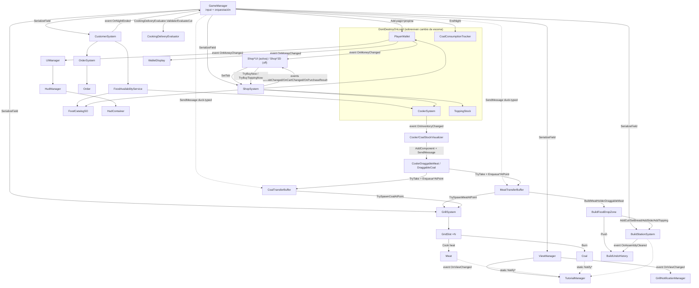

# ARQUITECTURA — Project_Parripollo

> Documentación técnica de referencia. Objetivo: entender el proyecto sin leer los scripts.

---

## 0. Ficha técnica

| Campo | Valor |
|---|---|
| Motor | Unity **2022.3.62f3**, URP (2D), Input Manager legacy (`Input.GetKeyDown`) |
| Cámara | **Perspectiva** (`orthographic: 0`, FOV `56`, en `z = -10`). No es ortográfica — ver nota 22 |
| Lenguaje | C#, assembly única `Assembly-CSharp` (sin `.asmdef` en `Assets/Scripts`) |
| Código propio | `Assets/Scripts/` — **115 archivos, ~15.2k líneas** |
| Third-party | `Assets/AmplifyShaderEditor/` (plugin de shaders, **ignorar**), TextMesh Pro |
| Género | Simulador de parrilla argentina: cocinar cortes, armar platos/sándwiches, entregar a clientes por noche |
| Persistencia | Solo `init.cfg` (resolución/FPS). **No hay savegame**: el progreso vive en objetos `DontDestroyOnLoad` |
| Idioma del dominio | Español (`Crudo`, `Jugoso`, `Hecho`, `Muy_Hecho`, `Pasado`, `Quemado`) |

**Escenas (build order)**: `0 MainMenuScene` → `1 GameScene` → `2 TutorialScene` → `3 EndScene`.
`SampleScene.unity` existe pero **no está en build** (legacy).

---

## 1. Estructura de módulos

```
Assets/Scripts/
├── (raíz)      Managers globales, modelo base de items/grilla, utilidades
├── Core/       Orquestación de partida + transferencia de items entre vistas
├── Grill/      Vista Parrilla: cocción, capas carne/carbón, HUD de hover
├── Cooler/     Stock persistente (CoolerSystem). Vista Heladera DEPRECADA → StockPanel
├── Build/      Vista Armado: plato, pan/guarniciones/toppings, undo, entrega por arrastre
├── Customers/  Clientes: spawn, paciencia, selección, burbujas de pedido
├── Orders/     Modelo y generación de pedidos
├── Food/       Catálogo (SO), validación de platos, evaluación económica de cocción
├── Shop/       Tienda (post-noche): tabs + breadcrumb, compra individual. Dos capas de UI
└── UI/         ViewManager, Tutorial, notificaciones de parrilla, HUD SO, feedback
```

### Responsabilidades por carpeta

| Carpeta | Responsabilidad | Archivos clave |
|---|---|---|
| **raíz** | Singletons de sesión (`UIManager`, `AudioManager`, `PlayerWallet`, `CoalConsumptionTracker`), modelo base drag&drop (`Item`), grilla (`GridSlot`), entidades físicas (`Meat`, `Coal`), buffer de carbón, arranque (`Init`), utilidades de escena | `Item.cs`, `GridSlot.cs`, `Meat.cs`, `Coal.cs`, `PlayerWallet.cs`, `CoalConsumptionTracker.cs`, `SceneManagementUtils.cs` |
| **Core/** | Bucle de partida e input global (`GameManager`), armado del plato (`BuildStationSystem`), staging de carne entre vistas (`MeatTransferBuffer`), draggables inter-vista, basura, pausa global (`GamePause`) | `GameManager.cs` (445), `MeatTransferBuffer.cs` (949), `BuildStationSystem.cs`, `GamePause.cs` |
| **Grill/** | Propagación de calor y spawn en grilla (`GrillSystem`), datos de corte (`MeatCutSO` — **está en `MeatType.cs`**), toggle capa carne/carbón, barra y burbuja de cocción por hover, contador de apilado de carbón | `GrillSystem.cs`, `MeatType.cs`, `GrillLayerToggle.cs`, `MeatCookHoverBar.cs`, `CoalStackCounter.cs` |
| **Cooler/** | Stock persistente `ItemDataSO → int` (`CoolerSystem`, DDOL). El resto de la carpeta (visualizadores y draggables de la heladera) está **deprecado** desde el StockPanel | `CoolerSystem.cs` · deprecados: `CoolerStockVisualizer.cs`, `CoalStockVisualizer.cs`, `CoolerDraggableMeat.cs`, `DraggableCoal.cs` |
| **Build/** | Zona de drop del plato (`BuildFoodDropZone`), draggables de pan/side/topping, frascos vertibles con salsa (`ToppingDraggable`), historial de undo (patrón Command), **entrega del plato por arrastre** (`PlateDeliveryDraggable`) | `BuildFoodDropZone.cs`, `ToppingDraggable.cs` (670), `BuildUndoHistory.cs`, `BuildUndoActions.cs`, `PlateDeliveryDraggable.cs` |
| **Customers/** | Spawn ponderado por noche, tick de paciencia, modo selección de entrega, view + burbuja + recuadro | `CustomerSystem.cs` (673), `Customer.cs`, `CustomerView.cs` |
| **Orders/** | `Order` (corte + punto pedido + pan/sides/toppings) y generación aleatoria ponderada | `OrderSystem.cs`, `Order.cs` |
| **Food/** | Catálogo estático (`FoodCatalogSO`), reglas de validez (`DishValidator`), **economía de entrega** (`CookingDeliveryEvaluator`), puente catálogo+stock (`FoodAvailabilityService`) | `CookingDeliveryEvaluator.cs`, `DishValidator.cs`, `FoodCatalogSO.cs` |
| **Shop/** | Lógica de tienda headless (`ShopSystem`) + **dos capas de UI paralelas**: `*UI` (uGUI/Canvas, **la activa** en `EndScene`) y `*2D` (world-space, prefab `ShopRoot` — presente pero **desactivado**) | `ShopSystem.cs`, `ShopGridUI.cs`, `ShopItemCellUI.cs`, `ShopBreadcrumbUI.cs`, `ShopHeaderUI.cs` |
| **UI/** | Conmutación de vistas (`ViewManager`), tutorial data-driven (`TutorialManager` + `TutorialStepSO`), notificaciones laterales de parrilla, feedback de entrega | `ViewManager.cs`, `TutorialManager.cs` (749), `GrillNotificationManager.cs` |
| **UI/StockPanel/** | Panel desplegable de stock dentro de la vista Grill: estado abierto/cerrado y layout (`StockPanelController`), celda + arrastre directo a la parrilla (`StockPanelSlot`), pestaña de toggle (`StockPanelTab`) | `StockPanelController.cs`, `StockPanelSlot.cs`, `StockPanelTab.cs` |

### Assets de datos

```
Assets/ScriptableObjects/
├── Cuts/            MeatCutSO   — Chinchulin, Costillita, Matambre, Paty, Pechuga, Tira de asado, Vacio
├── Breads/          BreadSO     — Pan de paty, Pan flauta
├── Sides/           SideSO      — Fritas, Ensalada verde, Ensalada de papa y huevo
├── Toppings/        ToppingSO   — Chimichurri, Salsa criolla
├── Tutorial/        TutorialStepSO ×30 (secuencia ordenada 1..30)
├── FoodCatalog.asset / FoodCatalogTutorial.asset
├── Upgrades/        UpgradeSO   — CoalBurnTimeUpgrade, CustomerCapacityUpgrade
├── ShopConfig.asset / CoalData.asset
└── Chorizo.asset, ChorizoTutorial.asset
```

---

## 2. Flujo de datos y comunicación

### 2.1 Grafo de dependencias



### 2.2 Patrones usados

| Patrón | Dónde | Detalle |
|---|---|---|
| **Singleton** (`static Instance`) | `GameManager`, `UIManager`, `AudioManager`, `PlayerWallet`*, `CoolerSystem`*, `ToppingStock`*, `CoalConsumptionTracker`*, `TutorialManager`, `BuildUndoHistory`, `GrillNotificationManager`, `MeatHoverBubble`, `MeatCookHoverBar`, `CustomerHoverBubble`, `CustomerSelectionFrame`, `DeliveryFeedbackText` | `*` = además `DontDestroyOnLoad`. Los de escena se reasignan en `Awake` sin guard. `GrillLayerToggle` usa `private static instance` |
| **Observer** (`event Action`) | Ver tabla 2.3 | Suscripción en `OnEnable`/`Start`, desuscripción en `OnDisable`/`OnDestroy` |
| **Static notification hub** | `TutorialManager.Notify*(...)` | 11 métodos estáticos no-op si `Instance == null` → en `GameScene` el tutorial no existe y nada cambia |
| **Command** | `IBuildUndoAction` + `BuildUndoHistory` (pila) | `AddSideUndoAction`, `AddToppingUndoAction`, `SetBreadUndoAction`. **La carne nunca es reversible** |
| **Buffer / staging area** | `MeatTransferBuffer`, `CoalTransferBuffer` | Guardan `BufferedMeatData`/`BufferedCoalData` (POCO con tiempos de cocción) y reconstruyen los visuales; permiten mover items entre vistas sin instanciar `Meat`/`Coal` reales |
| **Duck typing por reflexión / `SendMessage`** | `GameManager`→buffers, `MeatHolderDraggableMeat`, `CoolerDraggableMeat`, `*StockVisualizer` | `Type.GetType` sobre todos los assemblies + `MethodInfo.Invoke` / `SendMessage(..., DontRequireReceiver)`. Rompe el binding estático a propósito |
| **Registro estático de instancias** | `Coal.ActiveCoals`, `BuildFoodDropZone.ActiveZones`, `TrashZone.ActiveZones`, `ToppingDraggable.ActiveInstances` | Alta en `OnEnable`, baja en `OnDisable`/`OnDestroy`. Habilita APIs estáticas tipo `TryAcceptAt`, `ClearAllSplatters` |
| **Data-driven (ScriptableObject)** | `ItemDataSO` → `MeatCutSO`, `CoalSO`, `UpgradeSO`; `BreadSO`, `SideSO`, `ToppingSO`, `ProductVariantSO`, `FoodCatalogSO`, `ShopConfigSO`, `TutorialStepSO`, `HudDatabaseSO` | ⚠️ Los SO mutan en runtime (`isUnlocked`, `UpgradeSO.currentLevel`) → **el estado persiste entre sesiones de Editor** |
| **Service / Facade** | `FoodAvailabilityService` | Cruza `FoodCatalogSO` (estático) con `CoolerSystem` (stock live) |
| **Static utility / Extension methods** | `DishValidator`, `CookingDeliveryEvaluator`, `SceneManagementUtils`, `MeatHoverText.ToHoverString()`, `OrderText.ToHoverString()` | Sin estado, testeables aisladamente |
| **Object pool** | `GrillNotificationManager.groupPool` | Reutiliza grupos de notificación |
| **Construcción procedural de UI** | `GrillNotificationBubbleUI.CreateProceduralBubble`, `GrillNotificationGroupUI.CreateProceduralGroup`, `CustomerSelectionFrame.BuildBars`, `ToppingDraggable.CreateSauceBar` | Generan jerarquía + sprites (`Texture2D`) en runtime si falta prefab |
| **Template Method** | `Item` → `Meat` → `MeatInstance`; `GridSlot` → `GrillSlot` | `virtual OnMouseUp/HandleHeldInput/OnPickedUp/UpdateHoverPreview/Cook` |

### 2.3 Catálogo de eventos

| Emisor | Evento | Consumidores |
|---|---|---|
| `ViewManager` | `OnViewChanged(ViewType)` | `TutorialManager`, `GrillNotificationManager`, `StockPanelController` |
| `CustomerSystem` | `OnNightEnded` (campo `Action`) | `GameManager.EndNight` |
| `CoolerSystem` | `OnMissingItemRequested(ItemDataSO)` | (sin consumidor actual — hook futuro) |
| `BuildStationSystem` | `OnAssemblyChanged`, `OnAssemblyCleared` | `BuildUndoHistory.Clear` |
| `BuildUndoHistory` | `OnHistoryChanged` | `RollbackButtonUI` (habilita/deshabilita) |
| `PlayerWallet` | `OnMoneyChanged(float)` | `UIManager`, `WalletDisplay`, `ShopHeaderUI`, `ShopGridUI` (→ `RefreshVisuals` de cada celda), (2D: `ShopGrid2D`, `ShopHeader2D`) |
| `ToppingStock` | `OnStockChanged` | `ShopGridUI`, (2D: `ShopGrid2D`, `ShopDetailPanel2D`) |
| `ShopSystem` | `OnTabChanged` | `ShopGridUI` (rebuild), `ShopBreadcrumbUI`, `ShopSubtitleUI`, `ShopNextButtonUI`, (2D: `ShopTabBar2D`, `ShopGrid2D`) |
| `ShopSystem` | `OnCartChanged`, `OnPurchaseResult(bool,string)` | Solo la capa 2D. **La UI activa compra directo y no usa carrito** |
| `SceneManagementUtils` | `OnSceneLoaded` (static) | (disponible; suscrito vía `RuntimeInitializeOnLoadMethod`) |
| `ShopButton2D` / `ShopTabButton2D` | `OnClicked`, `OnTabClicked(ShopTabType)` | Celdas, barras de tabs |
| `CoalStock` | `OnChanged(int)` | (clase legacy, sin uso activo) |

### 2.4 Secuencia: del stock al cliente

```
StockPanel (dentro de la vista Grill) ──drag directo──► GridSlot de la parrilla
   │  StockPanelSlot.OnMouseDown  → spawnea un "fantasma" sin collider que sigue al mouse
   │  StockPanelSlot.OnMouseUp    → CoolerSystem.TryTake(item,1)
   │                              → GrillSystem.TrySpawnMeatAtPoint / TrySpawnCoalAtPoint
   │                              → si el spawn falla: CoolerSystem.Add(item,1)  [rollback]
   │  Sin buffer intermedio: el retiro y la colocación ocurren en la misma vista.

MeatHolder ──drag──► GridSlot de la parrilla        [sigue vivo para el round-trip con Build]
   │  MeatHolderDraggableMeat → (reflexión) MTB.TryDropFromMeatHolderById(id, punto, rot)
   │  → GrillSystem.TrySpawnMeatAtPoint → GridSlot.TryFindContiguousPlacement → PlaceMeat

Parrilla (cocción por frame)
   │  GrillSystem.Update      → UpdateHeatPropagation() reparte calor entre slots
   │  GridSlot.Update         → coal.Burn(); CalculateInternalHeat(); meat.Cook(totalHeatReceived)
   │  Meat.Cook               → acumula SOLO la cara activa; clamp en burnThreshold
   │  Click derecho           → MeatClickable → Meat.Flip() (cambia cara activa)

Parrilla ──drag a zona "ToBuild"──► ToBuild (buffer)
   │  Meat.OnMouseUp → MTB.TryQueueFromGrillToBuild(meat, punto)  [conserva tiempos de cocción]
   │  ──cambio a vista Build──► MTB.MoveToBuildMeatHolder()

BuildMeatHolder ──drag──► PlateDropZone
   │  BuildMeatHolderDraggableMeat → BuildFoodDropZone.TryAcceptMeatAt(punto, cut, state, A, B)
   │  → BuildStationSystem.AddCut(cut, state, sideA, sideB)
   │  Pan/Side/Topping → BuildDraggableFoodItem / ToppingDraggable → SetBread/AddSide/AddTopping + Push(undo)

Entrega — dos caminos hacia el MISMO método, GameManager.TryDeliverToCustomer(Customer)

  A) Teclado  [SPACE en vista Build]
   │  GameManager.TryEnterDeliverySelection → CustomerSystem.BeginDeliverySelection()
   │  A/D navega clientes · SPACE confirma → ConfirmDeliverySelection() → TryDeliverToCustomer(SelectedCustomer)

  B) Drag & drop  [arrastrar el plato con el mouse, vista Build]
   │  PlateDeliveryDraggable.OnMouseDown → agarra el plato COMPLETO como bloque
   │                                       (visuales de carne + sides/toppings) y guarda sus posiciones
   │  OnMouseDrag → Physics2D.OverlapPointNonAlloc busca CustomerView bajo el mouse
   │              → CustomerSystem.SetDeliveryDragHover(view) → CustomerSelectionFrame + burbuja de pedido
   │  OnMouseUp   → si soltó sobre un cliente: TryDeliverToCustomer(view.Customer)
   │              → si devuelve false (o soltó al vacío): el plato vuelve a la PlateDropZone

  Lógica compartida (TryDeliverToCustomer, devuelve bool):
   │     1. corte armado == order.PrimaryCut ?
   │     2. DishValidator.ValidateSandwich / ValidatePlatedDish
   │     3. CookingDeliveryEvaluator.Validate → Crudo/Quemado BLOQUEAN (X descarta quemados)
   │     4. CookingDeliveryEvaluator.EvaluateCut por corte → pago + propina
   │     5. PlayerWallet.Add · CustomerSystem.CompleteCustomer · limpiar plato → return true
```

---

## 3. Clases centrales

### 3.1 Orquestación

#### `GameManager` — `Core/GameManager.cs` · Singleton
Bucle de input global y árbitro de la entrega. **No** contiene lógica de cocción.

| Campos clave | |
|---|---|
| `[SF] customerSystem, grillSystem, coolerSystem, viewManager, buildStationSystem, shopSystem, wallet, grillLayerToggle, foodAvailabilityService, catalog` | Referencias de inspector |
| `[SF] MonoBehaviour meatTransferBuffer, coalTransferBuffer` | ⚠️ Tipados como `MonoBehaviour`: se invocan **solo por `SendMessage`** |
| `ViewType lastView` | Detecta transiciones de vista |
| `bool discardContextActive` / `List<int> discardBurnedIndices` | Contexto de descarte con `X`; solo activo tras una entrega bloqueada por quemados |
| `Customer discardCustomer` | Cliente del intento bloqueado. Necesario porque una entrega **por arrastre** no activa el modo de selección: sin esto, la `X` no sabría contra quién revalidar |

```csharp
public CustomerSystem Customers { get; }          // acceso para PlateDeliveryDraggable
public bool TryDeliverToCustomer(Customer)        // ÚNICO lugar con la lógica de entrega
public void EndNight()   // desuscribe, tracker.RegisterDayCompleted(), carga "EndScene"
// privados relevantes: TryToggleGrillLayer, ClearBuildAssembly, CleanAshes,
//                      TryDiscardBurnedCuts, TryEnterDeliverySelection, ConfirmDeliverySelection
```
`ConfirmDeliverySelection()` es un wrapper de una línea sobre `TryDeliverToCustomer(SelectedCustomer)`:
teclado y arrastre comparten validaciones, mensajes de `DeliveryFeedbackText`, pago y limpieza del plato.
El `bool` de retorno es **solo** para el arrastre: `false` = entrega rechazada → devolver el plato a la
`PlateDropZone`. `TryDiscardBurnedCuts` (`X`) revalida contra `SelectedCustomer` si el modo de selección
está activo, y contra `discardCustomer` si el intento vino de un arrastre.

#### `ViewManager` — `UI/ViewManager.cs`
```csharp
ViewType CurrentView { get; }
event Action<ViewType> OnViewChanged;
void Show(ViewType), NextView(), PreviousView()
```
`grillRoot` se oculta desactivando **renderers/colliders/canvases** (queda activo, sigue cocinando);
`coolerRoot`/`buildRoot` usan `SetActive` real.

⚠️ **La Cooler View está deprecada.** Las vistas navegables son solo `Grill` ↔ `Build`:
`NextView`/`PreviousView` recorren ese par y `Show(ViewType.Cooler)` **redirige a `Grill`** con un
warning. El miembro `ViewType.Cooler` se conserva a propósito porque el enum se serializa como `int`
en los assets de tutorial (`TutorialStepSO.requiredView`) y quitarlo correría `Build` y `Shop`.
`Toggle()` fue eliminado (no tenía llamadores).

#### `UIManager` — `UIManager.cs` · Singleton
```csharp
bool IsPaused { get; }
void PauseGame(), UnPauseGame()
void SetActualDay(int), SetTotalCustomers(int), SetActualCustomers(int), SetActualMoney(float)
int  GetActualDay(), GetActualMoney(), GetTotalCustomersPerDay(), GetActualCustomers()
```
Instancia `pauseCanvasPrefab` on-demand y delega el estado a `GamePause.SetMenuPaused`.
`IsPaused` refleja `GamePause.IsMenuPaused`, no el canvas. Delega el render a `HudManager` → `HudContainer`.

#### `GamePause` — `Core/GamePause.cs` · estática
```csharp
bool IsPaused, IsMenuPaused, IsDialogPaused
event Action OnPaused                           // una vez por transición no pausado → pausado
void SetMenuPaused(bool), SetDialogPaused(bool), Reset()
```
**Único escritor** de `Time.timeScale`, `Camera.main.eventMask` y `AudioListener.pause`. Dos fuentes
independientes (menú de `Esc` vía `UIManager`; diálogo de `TutorialOfferController`): el juego queda
pausado mientras cualquiera esté activa.

- `timeScale = 0` congela todo lo que usa `deltaTime` / `Time.time` / `WaitForSeconds`: cocción,
  carbón, paciencia, `SpawnLoop`, feedback de clientes, flips, salsas, burbujas.
- `eventMask = 0` apaga los `OnMouseXXX` de los colliders del mundo: solo responde la UI del canvas de pausa.
- `AudioListener.pause = true` silencia los SFX en curso.
- `OnPaused` cancela los arrastres en curso: cada draggable se suscribe al agarrar y se desuscribe al
  soltar/cancelar, y al pausar vuelve a su origen (`Item`, `MeatHolderDraggableMeat`,
  `CoalHolderDraggableCoal`, `ToBuildDraggableMeat`, `BuildDraggableFoodItem`, `ToppingDraggable`,
  `StockPanelSlot`, `PlateDeliveryDraggable`).
- `SceneManagementUtils` llama `Reset()` antes de cada carga: `timeScale` y `AudioListener.pause`
  persisten entre escenas.

---

### 3.2 Parrilla y cocción

#### `GrillSystem` — `Grill/GrillSystem.cs`
```csharp
List<GridSlot> slots;  GameObject meatPrefab, coalPrefab;
bool SpawnMeat(MeatCutSO, bool rotateFootprint = false)
bool TrySpawnMeatAtPoint(MeatCutSO, Vector3, out Meat, bool rotateFootprint = false)
bool TrySpawnCoalAtPoint(CoalSO, Vector3, out Coal)   // → CoalConsumptionTracker.ReportConsumption(1)
Meat GetCookedMeat(MeatCutSO)                         // ⚠️ sin llamadores desde que se borró GameManager.TryServe
void RemoveMeat(Meat)                                 // ⚠️ idem
void SetMeatVisualsVisible(bool)
```
`Awake` → `GridSlot.AssignGridCoordinates(slots)`. `Update` → `UpdateHeatPropagation()`:

```
reset:      slot.totalHeatReceived = slot.internalHeat
vecinos:    |dx|<=1 && |dy|<=1  → factor 0.35 (ortogonal) / 0.20 (diagonal)
columna:    |dx|<=1 && source.gridY > target.gridY && dy<=3 → factor 0.4 / dy
clamp:      AddExternalHeat → Mathf.Min(10f, ...)
```

#### `GridSlot` — `GridSlot.cs`
```csharp
ItemType acceptsType;  GameObject currentItem;  List<Coal> stackedCoals;  // MAX_COAL = 3
float internalHeat, totalHeatReceived;  int gridX, gridY;
bool IsOccupied { get; }   Meat currentMeat { get; }

void PlaceItem(GameObject), PlaceMeat(Meat), ClearSlot(), RemoveCoal(Coal)
bool CanPlaceItem(ItemType, GameObject)     // respeta GrillLayerToggle.IsItemTypeAllowed
void SetHoverPreview(bool, bool), ClearHoverPreview(), SetBaseHoverColor(Color)

static List<List<GridSlot>> BuildLogicalRows(IList<GridSlot>)
static void AssignGridCoordinates(IList<GridSlot>)
static bool TryFindContiguousPlacement(IList<GridSlot>, Vector2Int size, Vector3 worldPoint,
                                       ItemType, GameObject incoming, out List<GridSlot>)
```
`Update`: quema carbones → `CalculateInternalHeat()` (pila: `×1.0`, `×0.307`, `×0.153`) → `meat.Cook(totalHeatReceived)`.
Las filas se agrupan por Y mundial (`AXIS_TOLERANCE = 0.1`); **la columna es índice de orden dentro de la fila y por `acceptsType`** — nunca X mundial.

#### `Meat : Item` — `Meat.cs`
```csharp
MeatCutSO cut;  float sideACookTime, sideBCookTime;  bool isSideA;  MeatStates state;

float SideAProgress01, SideBProgress01, CookedPercent01, ActiveSideProgress01
float HeatScale, BurnThreshold
MeatStates SideAState, SideBState, ActiveSideState
bool IsAnySideBurned, IsOnGrill, IsSideAActive, IsGridRotated

virtual void Cook(float heatFromSlot)   // no-op si TutorialManager.IsCookingPaused; 1 vez por frame
void Flip()                             // invierte cara → TutorialManager.NotifyMeatFlipped
void SetCut(MeatCutSO), SetGridRotation(bool), ToggleGridRotation()
void RegisterOccupiedSlot(GridSlot), UnregisterOccupiedSlot(GridSlot), ReleaseOccupiedSlots()
void RefreshState()                     // deriva estado del calor → NotifyMeatStateChanged
```
`OnMouseUp` prioriza: `TrashZone` → `MeatTransferBuffer.TryQueueFromGrillToBuild` → colocación en grilla → volver a origen.
`R` mientras se arrastra rota el footprint. `MeatInstance : Meat` añade audio de chisporroteo.

#### `MeatCutSO : ItemDataSO` — **`Grill/MeatType.cs`** (nombre de archivo ≠ clase)
```csharp
string cutName => itemName;   Vector2Int GrillSpace;   Vector3 visualOffset;
CookingSprites cookingSpritesA, cookingSpritesB;   float timeHeatA, timeHeatB, heatScale;
ServingMode servingMode;   BreadSO requiredBread;   bool isUnlocked;
float sellPricePlate, sellPriceSandwich;

float GetHeatScale()        // heatScale, o timeHeat*3 si es 0
float GetStateBandHeat()    // S / 6
float GetBurnThreshold()    // 5S / 6  ← tope de acumulación por cara
MeatStates GetStateForHeat(float)   // floor(heat / band), clamp 0..5
Sprite GetSpriteForState(MeatStates, bool sideA)
```

**Modelo de cocción — la escala `S` se divide en 6 bandas iguales:**

| Índice | Estado | Rango de calor acumulado |
|---|---|---|
| 0 | `Crudo` | `[0, S/6)` — no entregable |
| 1 | `Jugoso` | `[S/6, 2S/6)` |
| 2 | `Hecho` | `[2S/6, 3S/6)` |
| 3 | `Muy_Hecho` (UI: "Bien Hecho") | `[3S/6, 4S/6)` |
| 4 | `Pasado` | `[4S/6, 5S/6)` — último punto válido |
| 5 | `Quemado` | `>= 5S/6` — irreversible, no entregable |

Cada cara acumula por separado. Solo acumula la cara **apoyada** (`isSideA`).

#### `Coal : Item` — `Coal.cs`
```csharp
static readonly List<Coal> ActiveCoals;   // registro global (usado por CleanAshes)
CoalSO coalData;  float maxBurnTime = 60f, currentBurnTime;  CoalStates state;
float GetCurrentHeatOutput()   // 6.5 * (1 - burnTime/maxBurnTime), solo si Encendido
void Burn(), SetVisualVisibility(bool), RegisterOccupiedSlot(GridSlot), ReleaseOccupiedSlots()
```
`enum CoalStates { Apagado, Encendido, Ceniza }` — `Apagado` pasa a `Encendido` en el primer `Burn()`.

#### `GrillLayerToggle` — `Grill/GrillLayerToggle.cs`
```csharp
enum GrillLayer { Meat, Coal }
GrillLayer CurrentLayer { get; }
static bool IsItemTypeAllowed(ItemType)   // gatea GridSlot.CanPlaceItem
void Toggle(), ShowLayer(GrillLayer), RefreshVisibility()
```
La capa inactiva queda visible con `inactiveAlpha` y colliders desactivados.
Dos entradas para `Toggle()`: el `OnMouseDown` del propio botón en la escena y `Space` desde
`GameManager.TryToggleGrillLayer()` (**solo en la vista `Grill`**). Ambas pasan por `ShowLayer`,
así que el icono del botón y `TutorialManager.NotifyGrillLayerChanged` quedan siempre sincronizados.

#### `CoalStackCounter` — `Grill/CoalStackCounter.cs`

Contiene también `CoalStackCounterStyle`. Feedback visual del stack de carbón: etiqueta `TextMeshPro`
(world-space) con el texto `x{N}` en la esquina **inferior derecha** del sprite de cada `GridSlot`
de tipo `Coal`.

| Aspecto | Detalle |
|---|---|
| Creación | `GrillSystem.Start()` → `SetupCoalStackCounters()` engancha un `CoalStackCounter` a cada slot con `acceptsType == ItemType.Coal` (60 en `GameScene`). No hay setup manual por slot |
| Anclaje | Hijo del slot. `rectTransform.pivot = (1,0)` + `localPosition` calculada desde `spriteRenderer.sprite.bounds` (esquina `max.x`, `min.y`) + offset configurable. Escala heredada del slot |
| Umbral | Solo visible con **2 o más** carbones apilados (`MIN_VISIBLE_COUNT = 2`). Con 1 o 0 no se muestra texto |
| Ocultamiento | También se oculta si la capa activa no es Coal (`GrillLayerToggle.IsItemTypeAllowed`) o si la vista no es Grill (`GrillSystem.SetMeatVisualsVisible` → `SetViewVisible`) |
| Refresco | `LateUpdate` por slot; solo reasigna texto y `SetActive` cuando el conteo o la visibilidad cambian |

**Configuración** (`GrillSystem` → header *Coal Stack Counter*, serializada en `Assets/Prefabs/[SYSTEMS].prefab`,
del que las escenas son instancias):

| Campo | Valor por defecto |
|---|---|
| `font` | `Assets/Fonts/Bungee-Regular SDF.asset` |
| `fontSize` | `4` (slot ≈ 0.52 × 0.55 unidades de mundo) |
| `textColor` | Blanco |
| `offset` | `(-0.06, 0.06)` — unidades locales hacia adentro desde la esquina inferior derecha |
| `sortingOrder` | `50` — por encima del sprite de carbón (`sortingOrder = 2`) |

**Gotcha (TMP 3.0.7)**: el `TextMeshPro` se agrega con el GameObject todavía en la raíz y **después** se
parenta al slot. Los slots pueden estar inactivos al arrancar (la partida abre en la vista Shop); si se
parenta primero, el `Awake` de TMP no corre, `m_renderer` queda null y asignar `.font` tira
`NullReferenceException` en `TMPro_Private.cs:526`. Por el mismo motivo el setup va en `Start()` y no en `Awake()`.

---

### 3.3 Inventario y transferencia

#### `CoolerSystem` — `Cooler/CoolerSystem.cs` · Singleton + DDOL
```csharp
event Action OnInventoryChanged;
event Action<ItemDataSO> OnMissingItemRequested;

int  GetCount(ItemDataSO)
IEnumerable<KeyValuePair<ItemDataSO,int>> EnumerateStock()
void Add(ItemDataSO, int = 1)          // carbón capeado a 40
void SetStockDirectly(ItemDataSO, int)
bool TryTake(ItemDataSO, int = 1)
void InformMissingItem(ItemDataSO)
static void PrepareForNewGame()        // invalida el backup estático
```
Guarda un `static stockBackup` en `OnDestroy` para sobrevivir a destrucciones inesperadas del DDOL; `SceneManagementUtils.ReturnToMainMenu()` lo limpia.

#### `StockPanelController` — `UI/StockPanel/StockPanelController.cs` · Singleton
Panel desplegable de stock, **solo dentro de la vista Grill**. Reemplaza a la Cooler View.
Vive anidado en `Prefabs/GrillView.prefab` como instancia de `Prefabs/UI/StockPanel.prefab`.

```csharp
static StockPanelController Instance;
bool IsOpen, IsAnimating, CanBeginDrag;
void Toggle(), Open(), Close(bool instant = false)
void RefreshSlots()
void NotifyDragStarted(StockPanelSlot), NotifyDragEnded(StockPanelSlot), CancelActiveDrag()
void SetViewManager(ViewManager)
bool IsPointOverPanel(Vector3), IsPointInDropArea(Vector3)
```

- **No duplica stock**: se suscribe a `CoolerSystem.OnInventoryChanged` y repinta. Las cantidades salen siempre de `GetCount`.
- **Orden de slots determinista**: `FoodCatalogSO.GetAllCuts()` filtrado por `stock > 0`, después los cortes con stock que no estén en el catálogo (ordenados por `itemName` — así aparece `ChorizoTutorial`), y el carbón **siempre último y siempre visible**, gris cuando está en 0. Nunca usar `EnumerateStock()` directo: el orden del `Dictionary` no es determinista.
- Layout de grilla manual (`columns`, `cellSpacing`, `firstCellLocalOffset`), slots pooleados, sin scroll.
- Se abre/cierra deslizando `SlidingRoot` en X con una corrutina que usa **`Time.unscaledDeltaTime`** (el diálogo de `TutorialOfferController` pone `Time.timeScale = 0` al entrar a `GameScene`).
- Arranca **cerrado** en `Start()`: `OnViewChanged` no dispara en el `Show(startView)` inicial porque `ViewManager.Show` solo invoca el evento si la vista cambió.
- Fuera de la vista Grill hace `SetActive(false)` sobre `SlidingRoot` — necesario porque `ViewManager.SetVisualVisibility` apaga `SpriteRenderer`/`Collider2D`/`Canvas` pero **no** los `MeshRenderer` de TextMeshPro.

#### `StockPanelSlot` — `UI/StockPanel/StockPanelSlot.cs`
Una celda = una variedad. `Bind(ItemDataSO, count, owner)`, `SetSortingOrder(int)`, `CancelDrag()`.
Maneja el arrastre completo desde `OnMouseDown` hasta `OnMouseUp` **en el mismo componente**: Unity
no transfiere `OnMouseDrag`/`OnMouseUp` a otro collider, así que el fantasma que sigue al mouse no
puede hacerse cargo del drag. `FitIconToSlot()` escala el ícono por `sprite.bounds` para que cortes
con sprites de distinto tamaño se vean uniformes. `R` rota el footprint (solo carne; el carbón no
tiene rotación en ninguna parte del proyecto).

Gates del drop, **antes** de cualquier `TryTake`:
1. Soltar sobre el propio panel cancela siempre (`IsPointOverPanel`).
2. `requireDropAreaHit` + `dropArea` (opcional, **off** por defecto) exige soltar dentro de un collider concreto. Apagado, el comportamiento es el mismo que los drags del `MeatHolder`.

#### `StockPanelTab` — `UI/StockPanel/StockPanelTab.cs`
Pestaña lateral con `BoxCollider2D` + `OnMouseDown` → `controller.Toggle()`.

#### `MeatTransferBuffer` — `Core/MeatTransferBuffer.cs` (949 líneas, el archivo más grande)
Cuatro colas paralelas de `BufferedMeatData` (POCO: `cut`, `sideACookTime`, `sideBCookTime`, `isSideA`, `state`, `isGridRotated`) + sus visuales y posiciones locales.

```
ToGrill ──[MoveToMeatHolder]──► MeatHolder ──[TryDropFromMeatHolderById]──► Parrilla
ToBuild ──[MoveToBuildMeatHolder]──► BuildMeatHolder ──[ConsumeBuildMeatEntry]──► Plato
```

```csharp
void EnqueueToGrill(MeatCutSO)
bool EnqueueToGrillAtPoint(MeatCutSO, Vector3)
bool EnqueueToBuildAtPoint(MeatCutSO, Vector3)
void MoveToMeatHolder(), MoveToBuildMeatHolder(), ClearBuildMeatHolder()
bool TryQueueFromGrillToBuild(Meat, Vector3)          // destruye el Meat, conserva la cocción
bool TryDropFromMeatHolder[ById](..., Vector3, bool rotateFootprint)
bool TryDropFromToBuild[ById](..., Vector3, bool rotateFootprint)
void ConsumeBuildMeatEntry(int entryId, GameObject)
void RemovePlateMeatVisualAt(int), ClearPlateMeatVisuals(), SetPlateMeatVisualsVisible(bool)
void UpdatePlateMeatSprite(Sprite)
bool TryCaptureLastPlateMeatVisual(out GameObject, out Sprite, out Vector3, out Vector3)  // undo
void RestorePlateMeatVisual(GameObject, Sprite, Vector3, Vector3)                          // undo
void UpdateMeatHolderHover(MeatCutSO, Vector3, bool), ClearMeatHolderHover(), RefreshVisuals()
```
Resuelve anclas por nombre si faltan en el inspector: `ToBuild` bajo `GrillView`, `MeatHolderSlot`/`MeatHolder` bajo `BuildView`.

#### `CoalTransferBuffer` — `CoalTransferBuffer.cs`
Análogo, dos colas (`ToGrill` → `CoalHolder`): `EnqueueToGrill[AtPoint]`, `MoveToCoalHolder()`, `TryDropFromCoalHolderById(int, Vector3)`, `UpdateCoalHolderHover`, `ClearCoalHolderHover`, `RefreshVisuals`.

---

### 3.4 Armado y entrega

#### `BuildStationSystem` — `Core/BuildStationSystem.cs`
```csharp
struct CutSideStates { MeatStates sideA, sideB; bool IsBurned, IsRaw; }

event Action OnAssemblyChanged, OnAssemblyCleared;
IReadOnlyList<MeatCutSO>     AssembledCuts
IReadOnlyList<MeatStates>    AssembledCutStates
IReadOnlyList<CutSideStates> AssembledCutSideStates
BreadSO AssembledBread;  IReadOnlyList<SideSO> AssembledSides;  IReadOnlyList<ToppingSO> AssembledToppings
bool HasAnyCut, HasBread

void AddCut(MeatCutSO, MeatStates state, MeatStates sideA, MeatStates sideB)
void RemoveLastCut(), RemoveCutAt(int), SetBread(BreadSO), AddSide(SideSO), AddTopping(ToppingSO)
void RemoveLastSide(SideSO), RemoveLastTopping(ToppingSO)   // usados por el undo
void ClearAssembly()
PlatedDish TryBuildPlatedDish(out string reason)
Sandwich   TryBuildSandwich(out string reason)
ProductVariantSO TryResolveVariant()
```

#### `PlateDeliveryDraggable` — `Build/PlateDeliveryDraggable.cs`

Entrega del plato **arrastrándolo con el mouse** hasta un cliente. Alternativa al flujo por teclado,
que queda intacto: ambos terminan en `GameManager.TryDeliverToCustomer`.

```csharp
public void RefreshCollider()   // re-mide el BoxCollider2D contra el sprite actual
// resto: Update (pick + drag + drop) + helpers estáticos
```

| Aspecto | Detalle |
|---|---|
| Creación | **Cero setup de escena.** `MeatTransferBuffer.AdoptVisualIntoPlate` lo hace `AddComponent` sobre cada visual de carne que queda en la zona del plato, justo donde destruye el `ToBuildDraggableMeat` |
| **Agarre (pick)** | **No usa `OnMouseDown`/`OnMouseDrag`/`OnMouseUp`.** El pick se resuelve en `Update`: `PickUnderPointer()` recorre las instancias, proyecta el mouse sobre el plano z de **cada candidato** (`GetMouseWorldPos`) y prueba `selfCollider.OverlapPoint`. Gana el de `sortingOrder` más alto. Ver nota 22 |
| Qué se arrastra | El plato **completo como bloque**: todas las instancias de `PlateDeliveryDraggable` + los visuales de sides/toppings que devuelve `BuildFoodDropZone.CollectActivePlateVisuals`. Agarrar cualquier sprite mueve todo |
| Estado del arrastre | `static`: la instancia que conduce (`activeDragger`), el frame del último pick (`lastPickFrame`, para no repetirlo por instancia) y las posiciones + `sortingOrder` de origen de cada visual. Hay un solo mouse: no hay arrastres concurrentes. El `sortingOrder` sube `+5000` mientras dura y se restaura al soltar |
| Gate de paneles | Si el punto cae sobre un `SlidingPanel` abierto (`StockPanelController` / `ToppingsPanelController` → `IsPointOverPanel`) el pick devuelve `null`: el click es del panel. Necesario porque, al no pasar por el raycast de Unity, nada más arbitra quién se queda con el click |
| Hover de cliente | `Physics2D.OverlapPointNonAlloc` sobre un buffer estático de 16 (sin GC por frame) → `GetComponentInParent<CustomerView>()` → `CustomerSystem.SetDeliveryDragHover(view)` |
| Rechazo | Si `TryDeliverToCustomer` devuelve `false`, o si se soltó fuera de un cliente, cada visual vuelve a su posición guardada sobre el plato. El mensaje ya lo muestra `GameManager` vía `DeliveryFeedbackText` |
| Cancelación | `OnDisable`/`OnDestroy` del visual que conduce llaman `CancelDrag()`: restauran posiciones y `sortingOrder` sin intentar el drop |
| Tutorial | `BeginDrag` dispara `TutorialManager.NotifyDeliverySelectionBegun()`: es el equivalente por mouse de entrar en modo selección, y sin eso el paso `25.BeginDelivery` quedaría colgado si el jugador usa el mouse |
| Collider | Se re-mide en `Awake` y cada vez que el pan cambia sprite/escala/rotación del visual (`MeatTransferBuffer.UpdatePlateMeatSprite` y `RestorePlateMeatVisual` llaman a `RefreshCollider()`) |

⚠️ Las salpicaduras de salsa (`SauceSplatter`, creadas por `ToppingDraggable`) **no** siguen al plato
durante el arrastre: quedan en el mostrador y se limpian con `ToppingDraggable.ClearAllSplatters()` en la entrega.

#### `CookingDeliveryEvaluator` — `Food/CookingDeliveryEvaluator.cs` · **static**
Núcleo de la economía. Constantes: `ReducedPriceMultiplier = 0.5`, `TipPercentOfPrice = 0.2`, `MinimumPerfectTip = 1`.

```csharp
struct CutResult          { int worstOffset; float price; bool tipEligible; }
struct DeliveryValidation { int rawCount, burnedCount; List<int> burnedIndices; bool IsBlocked; }

static DeliveryValidation Validate(IReadOnlyList<CutSideStates>,
                                   IReadOnlyList<MeatCutSO>, Func<MeatCutSO,bool> isBurnedExempt)
static CutResult EvaluateCut(MeatStates sideA, MeatStates sideB, MeatStates requested, float basePrice)
static float  CalculateTip(float basePrice, float patience01)
static string BuildBlockedMessage(int rawCount, int burnedCount)
```

| `worstOffset = max(|A−pedido|, |B−pedido|)` | Pago | Propina |
|---|---|---|
| `0` | 100 % | ✅ `max(1, floor(base × 0.2 × patience01))` |
| `1` | 100 % | ❌ |
| `>= 2` | `floor(base × 0.5)` | ❌ |

**Bloqueo**: cualquier cara `Crudo` o `Quemado` bloquea la entrega **completa** (atómica). `Quemado` tiene prioridad sobre `Crudo`. `isBurnedExempt` solo lo usa el tutorial (`TutorialManager.IsBurnedDeliveryExempt`) para evitar un softlock.

#### `DishValidator` — `Food/DishValidator.cs` · **static**
```csharp
static bool ValidatePlatedDish(PlatedDish, out string reason)   // rechaza SandwichOnly al plato
static bool ValidateSandwich(Sandwich, out string reason)       // rechaza PlatedOnly; exige requiredBread
static ProductVariantSO ResolveVariant(PlatedDish|Sandwich, FoodCatalogSO)
```

#### `BuildUndoHistory` — `Build/BuildUndoHistory.cs` · Singleton
```csharp
interface IBuildUndoAction { void Undo(); }
int Count { get; }   event Action OnHistoryChanged;
void Push(IBuildUndoAction), UndoLast(), Clear()
```
Se autolimpia con `BuildStationSystem.OnAssemblyCleared`. **Solo registra pan / guarniciones / toppings — nunca cortes de carne.**

---

### 3.5 Clientes y pedidos

#### `CustomerSystem` — `Customers/CustomerSystem.cs`
```csharp
Action OnNightEnded;                      // campo público, no `event`
Customer currentCustomer;                 // compat con GameManager
Customer SelectedCustomer { get; }
bool IsDeliverySelectionActive { get; }
bool IsReadyForSpawning { get; }
IReadOnlyList<Customer> ActiveCustomers { get; }
int  MaxSimultaneousCustomers { get; }    // base del inspector + mejoras compradas
FoodCatalogSO Catalog { get; }            // vía FoodAvailabilityService

void StartNight()
void SpawnCustomer(bool ignoreNightLimit = false)
void SelectCustomer(Customer), SelectAdjacentCustomer(int direction)
bool BeginDeliverySelection();  void EndDeliverySelection()
void CompleteCustomer(Customer), ShowSelectedOrderBubble()
bool IsCustomerActive(Customer)             // sigue esperando (no se fue ni fue atendido)
void SetDeliveryDragHover(CustomerView)     // resaltado durante el arrastre del plato; null limpia
```
`SetDeliveryDragHover` reusa `CustomerSelectionFrame` + `CustomerHoverBubble` sin tocar
`SelectedCustomer` ni `IsDeliverySelectionActive`: el arrastre y la selección por teclado conviven.
Al pasar `null` restaura lo que corresponda al modo teclado. Si el cliente resaltado se va enojado
a mitad del arrastre, `RemoveCustomer` suelta el recuadro antes de destruir la view.
Clientes por noche: `min(customersFirstNight + (noche−1) × customersAddedPerNight, maximumCustomersPerNight)`
(por defecto `20 + 5·(n−1)`, cap `70`; en `GameScene`: `10 + 2·(n−1)`, cap `30`).
**Clientes simultáneos** = `maxSimultaneousCustomers` (base del inspector, `3` en `GameScene`) +
`Catalog.GetMaxSimultaneousCustomersBonus()`. Se resuelve **una sola vez en `Start`** (dimensiona
`slotViews` y limita el `SpawnLoop`), así que una mejora comprada en la tienda recién impacta en la
noche siguiente. Sin `availabilityService` asignado no hay catálogo → warning y se usa solo la base.
⚠️ Los slots extra se posicionan con `autoFirstSlotPos + right × autoSlotSpacing × i`: al subir la
capacidad hay que verificar que los últimos slots sigan entrando en cámara.
`Update` descuenta paciencia y expulsa a los `IsAngry`. Al quedar `spawnedTonight >= target && activeCustomers == 0` → `OnNightEnded`.
`CompactSlots()` corre las views a la izquierda al liberarse un slot.

#### `Customer` — POCO
`type`, `order`, `patience`, `maxPatience`, `slotIndex`; `bool IsAngry`; `float Patience01`; `Init(...)`, `UpdatePatience(float)`.

#### `OrderSystem` / `Order` — `Orders/`
```csharp
OrderSystem(List<WeightedOrderCut> cuts);   Order GenerateOrder();
// punto pedido aleatorio en [Jugoso .. Pasado] — nunca Crudo ni Quemado
// sándwich si servingMode == SandwichOnly, o Both con 50 % de probabilidad
```
`Order`: `meat` (legacy) + `cuts`, `requestedStates`, `bread`, `sides`, `toppings`; `IsSandwich`, `PrimaryCut`, `SetSingleCut(cut, state)`, `GetRequestedState(int)`.

---

### 3.6 Progresión, economía y tienda

#### `CoalConsumptionTracker` — `CoalConsumptionTracker.cs` · Singleton + DDOL
**Fuente de verdad del progreso de la partida.**
```csharp
int   TotalCoalConsumed { get; }
int   DaysPlayed { get; }
int   CurrentNight => DaysPlayed + 1;
float AverageCoalPerDay { get; }
void  ReportConsumption(int), RegisterDayCompleted(), ConfigureNightTwoCut(MeatCutSO), ResetProgress()
```
`ApplyProgressionUnlocks()` fija `nightTwoCut.isUnlocked = (CurrentNight >= 2)`.

#### `PlayerWallet` — Singleton + DDOL
`float Money { get; }` · `event Action<float> OnMoneyChanged` · `CanAfford(float)`, `TrySpend(float)`, `Add(float)`. Arranca en `1000`.

#### `UpgradeSO` — `UpgradeSO.cs` · `ItemDataSO`
Mejora de tienda **por niveles**, data-driven. Los assets viven en `ScriptableObjects/Upgrades/` y se
registran en `FoodCatalogSO.allUpgrades` (de ahí los toma el tab `Upgrades`).
```csharp
bool isUnlocked;  int maxLevel = 1;  int currentLevel = 0;   // currentLevel muta y persiste
UpgradeEffectType effectType;        // CoalBurnTime | MaxSimultaneousCustomers
CoalSO targetCoal;  float upgradedMaxBurnTime;               // efecto CoalBurnTime
int customersPerLevel = 1;                                   // efecto MaxSimultaneousCustomers

int  CurrentLevel { get; }  int MaxLevel { get; }  bool IsMaxed { get; }
int  MaxSimultaneousCustomersBonus { get; }   // CurrentLevel × customersPerLevel, 0 si no aplica
bool Purchase()                               // +1 nivel y ApplyEffect(); false si ya está al máximo
void ApplyEffect()                            // idempotente: fija valor absoluto, no acumula
```
Dos maneras de aplicar el efecto, según a quién le pertenezca la variable:

| Efecto | Dónde vive el valor | Cómo se aplica |
|---|---|---|
| `CoalBurnTime` | `CoalSO._maxBurnTime` | `ApplyEffect()` → `targetCoal.SetMaxBurnTime(upgradedMaxBurnTime)`. Impacta al instante |
| `MaxSimultaneousCustomers` | el propio `currentLevel` | `ApplyEffect()` es no-op. `CustomerSystem.Start()` **lee** el bonus del catálogo. Impacta en la noche siguiente |

> Una variable de MonoBehaviour de escena (como `maxSimultaneousCustomers`) no se puede mutar desde la
> tienda: `EndScene` no tiene `CustomerSystem`. El patrón es guardar el nivel en el SO — que sobrevive
> al cambio de escena — y que el sistema de `GameScene` lo lea al arrancar.

| Asset | Efecto | Precio | Niveles |
|---|---|---|---|
| `CoalBurnTimeUpgrade` | `maxBurnTime` del carbón → `200` | `$500` | 1 |
| `CustomerCapacityUpgrade` | `+1` cliente simultáneo por nivel | `$100` / nivel | 3 |

⚠️ `currentLevel` se serializa en el asset: **si se compra en el Editor, queda comprado**. Para
resetear, ponerlo en `0` a mano en el inspector.

#### `ShopSystem` — `Shop/ShopSystem.cs`
Lógica pura, sin UI. Vive en `EndScene` (también hay una copia en `GameScene`).
```csharp
ShopTabType CurrentTab { get; } = Coal   // Coal → Meat → Upgrades → Toppings
event Action OnCartChanged, OnTabChanged;  event Action<bool,string> OnPurchaseResult;

void SetTab(ShopTabType)                                // no-op si ya es el tab actual
IReadOnlyList<ItemDataSO> GetItemsForCurrentTab() / GetItemsForTab(ShopTabType)
IReadOnlyList<ToppingSO>  GetToppings()
bool IsPurchasable(ItemDataSO), IsToppingPurchasable(ToppingSO)
int  GetSuggestedCoalUnits(), GetSuggestedCoalBags()    // max(0, consumoPromedio − stock)
int  GetTotalCoalUnits()                                // suma TODO el stock CoalSO del cooler
int  GetCartQty(ItemDataSO);  void SetQty(...), IncrementQty(...), ClearCart()
float CartTotal(), MoneyAfterPurchase();  int CartCoalBags()
List<MeatCutSO> GetLowStockCuts()
bool TryConfirmPurchase(out string)                      // carrito completo — solo la capa 2D
bool TryBuyNow(ItemDataSO, int qty, out string)          // ← compra individual (capa activa)
bool TryBuyToppingNow(ToppingSO, int qty, out string)    // ← compra individual (capa activa)
```

**Fuentes de items por tab** (`GetItemsForTab`):

| Tab | Origen | Filtro `IsPurchasable` |
|---|---|---|
| `Coal` | `ShopConfigSO.coal` (un solo item) | siempre `true` |
| `Meat` | `FoodCatalogSO.GetAllCuts()` | `cut.isUnlocked` |
| `Upgrades` | `FoodCatalogSO.GetAllUpgrades()` | `up.isUnlocked && !up.IsMaxed` |
| `Toppings` | `GetToppings()` → `catalog.GetAvailableToppings()` (devuelve `ToppingSO`, **no** `ItemDataSO`) | siempre `true` |

> El tab `Toppings` es el único que **no** pasa por `GetItemsForTab`: la UI llama a `GetToppings()` y bindea `ToppingSO`. Por eso `ShopGridUI` y `ShopItemCellUI` tienen una rama y un `Bind` por cada tipo.

**Compra individual vs. carrito** — coexisten dos caminos:

```
Compra individual (capa uGUI, la activa)
   ShopItemCellUI: −/+ ajustan un `pendingQty` LOCAL de la celda (no toca el carrito)
   → botón Comprar → ShopSystem.TryBuyNow(item, qty) / TryBuyToppingNow(topping, qty)
   → valida IsPurchasable → Wallet.CanAfford → Wallet.TrySpend
   → CoalSO: Cooler.Add(coal, unitsPerBag × qty) · UpgradeSO: up.Purchase() (+1 nivel) · resto: Cooler.Add(item, qty)
   → OnPurchaseResult(true, msg) + pendingQty vuelve a 1
   ⚠️ NO emite OnCartChanged. El refresco lo disparan Wallet.OnMoneyChanged y Cooler.OnInventoryChanged

Carrito (capa 2D, desactivada)
   SetQty/IncrementQty → cart / toppingCart → TryConfirmPurchase() paga todo junto
```
Dos carritos separados: `cart` (`ItemDataSO`) y `toppingCart` (`ToppingSO` → `ToppingStock`).
`UpgradeSO` está capado a cantidad 1 en ambos caminos: **una compra = un nivel**.

#### UI de tienda (capa uGUI activa) — `Shop/*UI.cs` · `EndScene`

Todos los componentes cuelgan de un `ShopSystem` asignado por inspector y usan el mismo patrón
`OnEnable` (suscribir) / `Start` (`started = true` + `Refresh`) / `OnDisable` (desuscribir);
el flag `started` evita refrescar antes del primer `Start`.

| Componente | Rol |
|---|---|
| `ShopBreadcrumbUI` | Puente entre los 4 `ShopTabButtonUI` y el `ShopSystem`. Se suscribe a `OnTabClicked` de cada botón → `shop.SetTab(tab)`; con `OnTabChanged` repinta cuál está activo (`SetActiveState`) |
| `ShopTabButtonUI` | `[RequireComponent(Button)]`. Expone `ShopTabType Tab` y `Action<ShopTabType> OnTabClicked`. `SetActiveState(bool)` cambia color de `background` y `label` (activo/inactivo) |
| `ShopHeaderUI` | Header: nombre de la tienda, plata (`$N0`) y **total de carbón** (`"Carbon: {GetTotalCoalUnits()} u."`). Se suscribe a `Wallet.OnMoneyChanged` **y** `Cooler.OnInventoryChanged` |
| `ShopGridUI` | Reconstruye la grilla al cambiar de tab. `AdjustCellCount` instancia/destruye celdas (`ShopItemCell 1.prefab`) bajo el `Content` del ScrollView y las bindea. Ante cambios de stock/plata solo llama `RefreshVisuals()` de cada celda (no reconstruye) |
| `ShopItemCellUI` | Celda: icono, nombre, descripción (+ `"Nivel X/Y"` si la mejora tiene varios niveles), precio, `pendingQty`, subtotal. Dos `Bind` (`ItemDataSO` / `ToppingSO`). Deshabilita `−` en `qty == 1`, y `Comprar` si el item no es comprable o no alcanza la plata. `lockedOverlay` + icono atenuado para lo bloqueado |
| `ShopSubtitleUI` | Título + detalle por tab. En `Coal` el detalle es dinámico: `"USASTE {AverageCoalPerDay} UNIDADES DE CARBÓN"`, o `"PRIMERA NOCHE — SIN DATOS DE CONSUMO"` si `DaysPlayed == 0` |
| `ShopNextButtonUI` | Avanza `Coal → Meat → Upgrades → Toppings` cambiando el label; en `Toppings` el botón carga `GameScene` |

Navegación por tabs: **dos entradas** — el breadcrumb (salto directo a cualquier tab) y el botón
"Siguiente" (avance secuencial). Ambas terminan en `ShopSystem.SetTab`, así que el estado visual
queda sincronizado por el evento `OnTabChanged`.

---

### 3.7 Tutorial

#### `TutorialManager` — `UI/TutorialManager.cs` · Singleton
Máquina de estados data-driven sobre `List<TutorialStepSO>` (30 pasos). **Solo arranca si `SceneManagementUtils.GetCurrentName() == "TutorialScene"`.**

```csharp
static bool IsCookingPaused { get; }      // leído por Meat.Cook
static bool IsBurnedDeliveryExempt(MeatCutSO)
void StartTutorial(), AdvanceStep()

// Hub estático de notificaciones (no-op si Instance == null):
static void NotifyMeatDraggedToGrill/ToBuild(MeatCutSO)
static void NotifyCoalDraggedToGrill(CoalSO), NotifyCoalPlacedOnGrill(CoalSO)
static void NotifyMeatPlacedOnGrill(MeatCutSO), NotifyMeatPlacedOnBuildZone(MeatCutSO)
static void NotifyGrillLayerChanged(GrillLayerToggle.GrillLayer)
static void NotifyMeatFlipped(MeatCutSO), NotifyMeatStateChanged(Meat)
static void NotifyDeliverySelectionBegun(), NotifyProductDelivered()
```
Hace backup del stock real del `CoolerSystem`, lo sustituye por el del tutorial (`ChorizoTutorial=3`, `Coal=3`, resto `0`) y lo restaura al terminar. Al finalizar carga `GameScene`.

`TutorialConditionType`: `ChangeView, ConfirmButton, DragMeatToGrill, DragMeatToBuild, DragCoalToGrill, DragMeatToGrillSlots, ToggleGrillLayer, DragCoalToGrillSlots, FlipMeat, MeatReachesDoneness, DragMeatToMeatHolder, BeginDeliverySelection, DeliverProduct, DragMeatToBuildZone`.

---

## 4. Puntos de entrada e inicialización

### 4.1 Arranque de la aplicación

```
MainMenuScene (build index 0)
  ├── Init.Awake()                        ← ÚNICO punto de config de plataforma
  │     lee %USERPROFILE%/AppData/.../init.cfg  (Application.persistentDataPath)
  │     claves: TargetFPS=120, ResolutionX=1920, ResolutionY=1080, Fullscreen=true
  │     aplica Application.targetFrameRate + Screen.SetResolution
  └── MainMenuPanel.StartNewGame() → LoadSceneByName("GameScene")

[RuntimeInitializeOnLoadMethod]
  SceneManagementUtils.Initialize()          BeforeSceneLoad  → engancha SceneManager.sceneLoaded
  GrillNotificationManager.AutoInitialize()  AfterSceneLoad   → crea el manager si no existe
```

### 4.2 Orden de inicialización en `GameScene`

| Fase | Qué corre |
|---|---|
| `Awake` | Singletons se registran (`GameManager`, `UIManager`, `AudioManager`, `CoolerSystem`+DDOL, `PlayerWallet`+DDOL, `ToppingStock`+DDOL, `CoalConsumptionTracker`+DDOL, `BuildUndoHistory`). `GrillSystem.AssignGridCoordinates`. `CoolerSystem.BuildInitialStockRuntime()` (o restaura backup) |
| `OnEnable` | Visualizadores y UI se suscriben a `OnInventoryChanged` / `OnMoneyChanged` |
| `Start` | `ViewManager.Show(startView)` · `CustomerSystem` calcula la noche, aplica desbloqueos, crea `OrderSystem` y lanza `StartNight()` · `GameManager` se suscribe a `OnNightEnded` y publica el día en el HUD · buffers resuelven tipos por reflexión y llaman `RefreshVisuals()` |
| `Update` | Ver 4.3 |

> ⚠️ `TutorialManager.Start` y `CustomerSystem.Start` pueden correr en cualquier orden: el spawn forzado del tutorial espera un frame y reintenta hasta 5 s.

### 4.3 Game loop (por frame)

| Componente | `Update` |
|---|---|
| `GameManager` | `Esc` → `UIManager.PauseGame/UnPauseGame` (ignorada durante el diálogo de oferta); con `GamePause.IsPaused` corta el resto del input global. Sincroniza visibilidad de carne/plato al cambiar de vista; dispara `MoveToMeatHolder` / `MoveToCoalHolder` / `MoveToBuildMeatHolder` en las transiciones |
| `GrillSystem` | `UpdateHeatPropagation()` — recalcula el calor de todos los slots |
| `GridSlot` (×N) | Quema carbones → calcula calor interno → `meat.Cook(totalHeatReceived)` |
| `Meat` | Efectos (calor/humo); si está agarrado: `HandleHeldInput` + `UpdateHoverPreview` |
| `CustomerSystem` | Descuenta paciencia y expulsa clientes enojados |
| `GrillNotificationManager` | Si la vista ≠ `Grill`: reagrupa las carnes por `MeatCutSO` y refresca las burbujas |
| Corrutinas | `CustomerSystem.SpawnLoop` (cada `spawnIntervalSeconds`, def. `6 s`) |
| `CoalStackCounter` (×60) | **`LateUpdate`**: cuenta el stack del slot; solo toca texto/`SetActive` si el conteo o la visibilidad cambiaron |

### 4.4 Controles

| Tecla | Contexto | Acción |
|---|---|---|
| `Esc` | Global | Pausa / reanudar vía `GamePause`: congela tiempo, audio e input del mundo y cancela arrastres. Ignorada mientras el diálogo de oferta del tutorial está abierto |
| `Q` | Grill | Abre / cierra el **StockPanel** (`stockPanelToggleKey`, configurable en `GameManager`) |
| `W` / `E` | Global | Grill / Build |
| `←` / `→` | Global | Vista anterior / siguiente (**solo Grill ↔ Build**) |
| `Space` | Grill | Cambia la capa carne ↔ carbón (`TryToggleGrillLayer` → `GrillLayerToggle.Toggle`; ignorado si hay un drag activo) |
| `R` | Grill | `CleanAshes()` — destruye carbones en `Ceniza` |
| `R` | mientras se arrastra | Rotar footprint del corte |
| Click derecho | sobre carne en parrilla | `Meat.Flip()` |
| `Space` | Build | Entrar a selección de cliente / confirmar entrega |
| Arrastrar el plato | Build | Entrega por **drag & drop**: soltar sobre un cliente entrega; soltar al vacío o entrega rechazada → el plato vuelve a la `PlateDropZone` |
| `A` / `D` | Build, seleccionando | Cliente anterior / siguiente |
| `X` | Build, entrega bloqueada | Descartar cortes quemados y revalidar |
| `R` | Build, sin seleccionar | Limpiar el plato entero |
| `M` | Build | Informar corte faltante |

### 4.5 Ciclo de noche

```
GameScene ──[último cliente atendido/expulsado]──► CustomerSystem.OnNightEnded
   └─► GameManager.EndNight()
         ├─ CoalConsumptionTracker.RegisterDayCompleted()   // DaysPlayed++, aplica desbloqueos
         └─ LoadSceneByName("EndScene")

EndScene
   ├─ EndScreen        muestra el dinero · botones: MainMenu / Retry / GoShopping
   ├─ ShopSystem       tabs Coal → Meat → Upgrades → Toppings  (arranca en Coal)
   │     Header:     nombre de tienda · plata · total de carbón en el cooler
   │     Breadcrumb: 4 ShopTabButtonUI → SetTab (salto directo a cualquier tab)
   │     Grid:       celdas con −/+ y botón Comprar → TryBuyNow / TryBuyToppingNow (pago inmediato)
   │     Next:       avance secuencial de tab; en Toppings → SceneManager.LoadScene("GameScene")
   └─ ShopRoot        prefab de la capa 2D — presente en la escena pero con m_IsActive = 0

SceneManagementUtils.ReturnToMainMenu()   ← reset total
   destruye PlayerWallet, CoalConsumptionTracker, CoolerSystem, ToppingStock (los 4 DDOL)
   + CoolerSystem.PrepareForNewGame()  (invalida el backup estático de stock)
```

---

## 5. Notas para trabajar sobre el código

| # | Nota |
|---|---|
| 1 | **`MeatCutSO` vive en `Grill/MeatType.cs`**; `GrillSlot` en `Grill/GrillSlots.cs`. Los nombres de archivo no siempre coinciden con la clase. `Grill/GrillSys2.cs` está **vacío** |
| 2 | `GameManager` habla con los buffers **solo por `SendMessage`** (campos tipados `MonoBehaviour`). Renombrar `MoveToMeatHolder`, `MoveToCoalHolder`, `MoveToBuildMeatHolder`, `ClearPlateMeatVisuals`, `RemovePlateMeatVisualAt`, `SetPlateMeatVisualsVisible` **rompe en silencio** |
| 3 | `MeatHolderDraggableMeat` y `CoolerDraggableMeat` invocan al buffer por **reflexión** (`MethodInfo`), probando primero la sobrecarga de 3 parámetros y cayendo a la de 2 |
| 4 | Los visualizadores hacen `AddComponent(Type resuelto por nombre)` + `SendMessage("SetCut"/"SetCoalData"/"SetCoolerSystem"/"SetTransferBuffer"/"SetToGrillDropArea"/"SetTransferEntryId")` |
| 5 | Los `ScriptableObject` **mutan en runtime** (`isUnlocked`, `isPurchased`, `ProductVariantSO.isUnlocked`) → el estado se filtra entre sesiones del Editor |
| 6 | Todos los singletons usan el mismo guard en `Awake`: `if (Instance != null && Instance != this) { Destroy(gameObject); return; } Instance = this;`. Mantener esa forma al agregar nuevos |
| 7 | Vista `Grill`: el root **no se desactiva** — se apagan renderers/colliders/canvases, así que la parrilla **sigue cocinando en segundo plano** (por diseño). Por eso existen las notificaciones de `GrillNotificationManager` |
| 8 | `Shop` tiene **dos capas de UI paralelas**. La activa hoy es **`*UI` (uGUI, en `EndScene`)**; la capa `*2D` sigue en la escena dentro del prefab `ShopRoot` pero **desactivada** (`m_IsActive: 0`) — al tocar la tienda, editar los `*UI`. `ShopGlobalBar2D.cs` declara la clase `ShopHeader2D` |
| 8b | La capa activa **no usa el carrito**: cada celda compra por su cuenta con `TryBuyNow`/`TryBuyToppingNow`, que **no emiten `OnCartChanged`**. `cart`/`toppingCart`, `CartTotal()`, `TryConfirmPurchase()` y `OnCartChanged` quedan vivos solo para la capa 2D |
| 8c | `ShopItemCellUI.pendingQty` es estado **local de la celda** y se resetea a 1 tras comprar o rebindear; no sobrevive a un cambio de tab, porque `ShopGridUI.RebuildAll` rebindea todas las celdas |
| 8d | `ShopTabButtonUI` y `ShopGridUI` tienen `Debug.Log` de diagnóstico (`Awake`, `HandleClick`, `RebuildAll`) — quitarlos antes de release |
| 9 | `ViewType.Shop` está en el enum pero `ViewManager` no lo maneja — la tienda es una escena aparte |
| 10 | Clases sin uso activo: `ShopCart`, `CoalStock`, `MeatTypes` (enum), `GridTransformGroup` es `[ExecuteAlways]` solo para layout de editor |
| 11 | Varios archivos tienen **mojibake** por encoding (`carb�n`, `�tem`) en literales y comentarios: `CoalSO.cs`, `CoolerSystem.cs`, `TrashZone.cs`, `HudManager.cs`, `OrderText.cs`, `TutorialStepSO.cs` |
| 12 | El estado de cocción real vive en los `float sideACookTime/sideBCookTime`; `Meat.state` es solo caché visual derivado por `RefreshState()` |
| 13 | `GridSlot.Update`, `GrillSystem.UpdateHeatPropagation` y `Meat.Cook` corren **por frame y por slot**: no agregar `Debug.Log` ni allocations ahí |
| 14 | `CoalSO.unitsPerBag` pasó de `10` a **`1`**: una "bolsa" es una unidad, así que `Cooler.Add(coal, unitsPerBag × qty) == qty`. `GetSuggestedCoalBags()` y `CartCoalBags()` siguen razonando en bolsas — si `unitsPerBag` vuelve a subir, revisar también el texto del header (`GetTotalCoalUnits()` cuenta **unidades**, no bolsas) |
| 15 | **Cooler View deprecada.** Sus scripts (`CoolerStockVisualizer`, `CoalStockVisualizer`, `CoolerDraggableMeat`, `DraggableCoal`) y sus assets (`Prefabs/CoolerView.prefab`, `StockPrefab.prefab`) siguen en el proyecto pero **ya no se alcanzan**: `Show(Cooler)` redirige a Grill, así que `coolerRoot` queda desactivado desde el primer `Show`. Los cuatro scripts llevan cabecera `DEPRECADO`; la de `DraggableCoal` avisa además que descuenta stock **antes** de validar el buffer y **sin rollback**, por si alguien lo copia como referencia. No borrar sin revisar los overrides de escena |
| 16 | `GrillView` tiene **escala no uniforme `(0.81, 1, 1)`** como override de escena. Cualquier hijo nuevo que deba verse sin deformar necesita contra-escala (`localScale.x = 1/0.81`). Es lo que hace la instancia de `StockPanel` |
| 17 | **`TutorialScene` está rota** desde el refactor del cooler: los pasos `2.PrimeraParteCooler`, `9.PasarACooler` y `12.VolverGrillView` usan `ChangeView` hacia/desde `Cooler` y ese evento ya no dispara. Los pasos de arrastre (10/11) sí funcionan porque el drop directo del panel emite las notificaciones existentes. Pendiente de decisión: rehacer esos pasos, saltearlos o sacar la escena del build. Además falta wirear en `TutorialScene` la contra-escala del panel y sus refs (`grillSystem`, `viewManager`, buffers) |
| 18 | **Toda pausa pasa por `GamePause`** (`Core/GamePause.cs`): nadie más escribe `Time.timeScale`. El diálogo de `TutorialOfferController` (al entrar a `GameScene`) y el menú de `Esc` son dos fuentes de la misma pausa. Una animación de UI que deba correr en pausa necesita `Time.unscaledDeltaTime`; un loop `yield return null` + unscaled **sigue corriendo en pausa** y necesita gate propio (`TutorialManager.SpawnTutorialCustomerWhenReady` ya lo tiene). Draggables nuevos: suscribirse a `GamePause.OnPaused` al agarrar, desuscribirse al soltar, y guardar `OnMouseDrag`/`OnMouseUp` con el flag de arrastre porque tras cancelar puede llegar un `OnMouseUp` tardío. Un pick que no use `OnMouseXXX` (como `PlateDeliveryDraggable.Update`) debe chequear `GamePause.IsPaused`: `eventMask` no lo frena |
| 19 | La entrega tiene **dos entradas y una sola lógica**: `GameManager.TryDeliverToCustomer(Customer)`. Al tocar validaciones, pagos o mensajes, editar **solo ahí** — `ConfirmDeliverySelection` (SPACE) y `PlateDeliveryDraggable` (mouse) son cáscaras. El `bool` de retorno lo consume el arrastre para decidir si devuelve el plato a la `PlateDropZone`: si se agrega un camino de rechazo nuevo, tiene que devolver `false` o el plato desaparece del mostrador |
| 20 | `PlateDeliveryDraggable` se agrega **en runtime** desde `MeatTransferBuffer.AdoptVisualIntoPlate`. Es el único lugar que crea visuales de carne en el plato: si aparece otro camino que ponga un corte en la zona del plato, tiene que agregar el componente o ese plato no se podrá arrastrar |
| 21 | Los clientes se instancian con `customersParent = null` (raíz de escena), así que **no** los alcanza el toggle de `ViewManager` y sus colliders siguen activos. De eso depende el hover de la entrega por arrastre (`Physics2D.OverlapPointNonAlloc`). Si algún día se cuelgan de un root de vista, se rompe el drag & drop de entrega |
| 22 | **La cámara está en perspectiva** (`orthographic: 0`, FOV `56`, en `z = -10`). Dos consecuencias, y las dos ya mordieron: (a) **nunca** `cam.ScreenToWorldPoint(Input.mousePosition)` a secas — con `z = 0` devuelve la posición de la cámara. Siempre `pos.z = Mathf.Abs(objeto.z - cam.z)` antes de convertir (`Item.GetMouseWorldPosition` es la referencia; lo repiten `Meat.RestoreHoverIfPointerOver`, `ToBuildDraggableMeat`, `StockPanelSlot`, `PlateDeliveryDraggable`). (b) El pick interno de Unity (`OnMouseDown` sobre `Collider2D`) reparte el click a **un solo** collider, y los visuales del plato quedan apoyados sobre el de la zona `ToBuild` — mismo plano `z = 0` y sin handler de mouse — así que se lo quedaba la zona y la carne del plato dejaba de ser agarrable. Por eso `PlateDeliveryDraggable` resuelve su propio pick en `Update` en vez de usar `OnMouseXXX`. Si algún otro objeto apilado sobre un collider "mudo" deja de responder al mouse, es el mismo caso |
